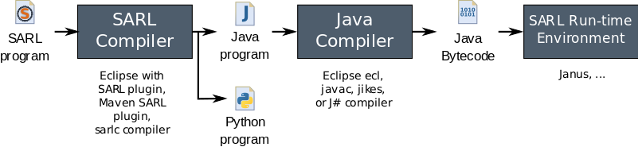

# Basics of the SARL Compilation Process

<ul class="page_outline" id="page_outline">

<li><a href="#1-standard-compilation-process">1. Standard Compilation Process</a></li>
<li><a href="#2-other-target-languages-than-java">2. Other Target Languages Than Java</a></li>
<li><a href="#3-legal-notice">3. Legal Notice</a></li>

</ul>

##1. Standard Compilation Process

The SARL tool-chain is the set of programming tools that are used to perform a multiagent system with SARL.
As illustrated on the following figure, three types of tools are used in sequence in order to create and
run an agent-based system:

* **SARL Compiler:** The SARL compiler transforms the source SARL language into the target language.
  Several target languages may be considered by this compiler. Because most of the agent frameworks are
  written in Java, the SARL compiler targets this object-oriented programming language by default.
  The SARL compiler translates SARL statements into their object-oriented equivalent statements. Three different
  implementations of the SARL compiler are provided: a specific command-line tool ([sarlc](../tools/Sarlc.html)), the Eclipse development
  environment plug-in, and a [Maven plug-in](https://mvnrepository.com/artifact/io.sarl.maven/sarl-maven-plugin).
* **Java Compiler:** The files generated by the SARL compiler when it is using the Java generator (see below) are standard Java’s files. They must be compiled with
  one of the compilation tools that are available: Eclipse’s ecl, Oracle’s javac, IBM’s jikes... The result from
  the Java compilation is a collection of binary files (a.k.a. byte-code files) that may be run by a virtual machine.
* **SARL Run-time Environment:** The SARL Run-time Environment (SRE) is a collection of tools that enables the
  run of an agent-based application written with SARL. Such an SRE must implement each service and feature that are
  assumed to be provided by the run-time environment. When the target platform is Java-based, the SRE is composed by
  a standard Java Runtime Environment (JRE), and the Janus Java library, which provides the base classes for running
  agents written with SARL. In this latest example, a command-line tool is provided for launching the Janus platform:
  [janus](../tools/Janus.html).

##2. Other Target Languages Than Java

As explained in the previous section, the default target language for the SARL compiler is the Java object-oriented programming language.
Hopefully,you could configure the SARL compiler for enabling the generation to another target language 

* [Python](./PythonGeneration.html)

##3. Legal Notice

* Specification: SARL General-purpose Agent-Oriented Programming Language ("Specification")
* Version: 0.6
* Status: Draft Release
* Release: 2017-08-31

> Copyright &copy; 2014-2017 [the original authors or authors](http://www.sarl.io/about/index.html).
>
> Licensed under the Apache License, Version 2.0;
> you may not use this file except in compliance with the License.
> You may obtain a copy of the [License](http://www.apache.org/licenses/LICENSE-2.0).
>
> You are free to reproduce the content of this page on copyleft websites such as Wikipedia.

<small>Generated with the translator io.sarl.maven.docs.generator 0.6.0-SNAPSHOT.</small>