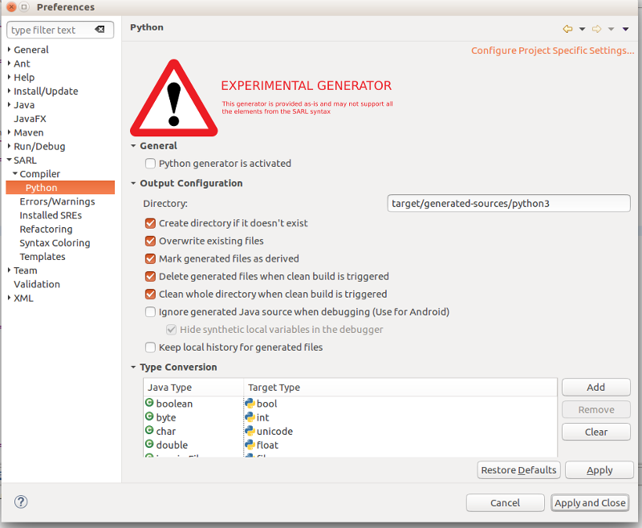

# Generation to the Python Language

<ul class="page_outline" id="page_outline">

<li><a href="#1-integration-to-the-standard-compilation-process">1. Integration to the Standard Compilation Process</a></li>
<li><a href="#2-enabling-and-configuring-the-python-generator">2. Enabling and Configuring the Python Generator</a></li>
<li><a href="#3-legal-notice">3. Legal Notice</a></li>

</ul>

Python is a widely used high-level programming language for general-purpose programming, created by Guido van Rossum.
As an interpreted language, Python has a design philosophy that emphasizes code readability, and a syntax that allows
programmers to express concepts in fewer lines of code than might be used in languages such as C++ or Java.

## 1. Integration to the Standard Compilation Process

The Python generator for SARL compiler is included into the SARL tool-chain, as illustrated by the following figure.

## 2. Enabling and Configuring the Python Generator

For enabling and configuring the Python generator, you must open the dedicated preference page into the SARL development environment.
It is accessible by:

* opening the menu item: `Window > Preferences`.
* opening the preference section: `SARL > Compiler > Python`  

You should show a dialog box similar to the following figure.

This preference page will enable you to:

* enable and disable the Python generation;
* configure the Python generator;
* map the Java typenames to their Python equivalents;
* map the Java feature calls to their Python equivalents.

## 3. Legal Notice

* Specification: SARL General-purpose Agent-Oriented Programming Language ("Specification")
* Version: 0.12
* Status: Draft Release
* Release: 2020-08-21

> Copyright &copy; 2014-2020 [the original authors or authors](http://www.sarl.io/about/index.html).
>
> Licensed under the Apache License, Version 2.0;
> you may not use this file except in compliance with the License.
> You may obtain a copy of the [License](http://www.apache.org/licenses/LICENSE-2.0).
>
> You are free to reproduce the content of this page on copyleft websites such as Wikipedia.

<small>Generated with the translator io.sarl.maven.docs.generator 0.12.0-SNAPSHOT.</small>