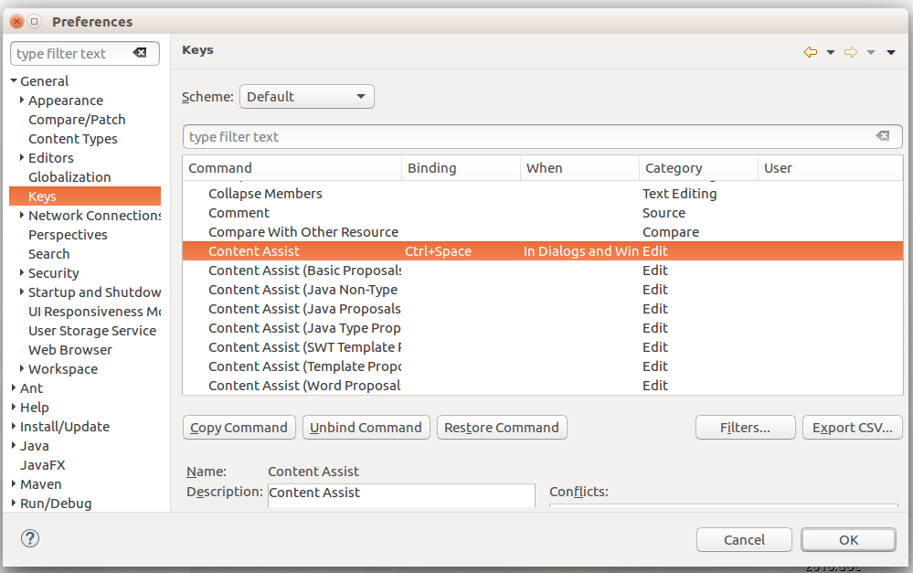

# General FAQ for SARL


<ul class="page_outline" id="page_outline">

<li><a href="#1-general-questions-about-sarl">1. General Questions about SARL</a></li>
<ul>
  <li><a href="#1-1-what-is-sarl">1.1. What is SARL?</a></li>
  <li><a href="#1-2-can-i-use-sarl-to-make-agent-based-software">1.2. Can I use SARL to make agent-based software?</a></li>
  <li><a href="#1-3-can-i-use-sarl-to-make-agent-based-simulation-software">1.3. Can I use SARL to make agent-based simulation software?</a></li>
  <li><a href="#1-4-can-i-use-sarl-to-make-holonic-software">1.4. Can I use SARL to make holonic software?</a></li>
  <li><a href="#1-5-can-i-use-sarl-to-make-organizational-software">1.5. Can I use SARL to make organizational software?</a></li>
  <li><a href="#1-6-is-sarl-an-object-oriented-programming-language">1.6. Is SARL an object-oriented programming language?</a></li>
  <li><a href="#1-7-can-i-use-my-java-classes-in-sarl">1.7. Can I use my Java classes in SARL?</a></li>
  <li><a href="#1-8-must-i-use-maven-to-create-a-sarl-project">1.8. Must I use Maven to create a SARL project?</a></li>
  <li><a href="#1-9-what-is-the-sre">1.9. What is the SRE?</a></li>
  <li><a href="#1-10-what-is-the-difference-between-sarl-and-janus">1.10. What is the difference between SARL and Janus?</a></li>
  <li><a href="#1-11-where-can-i-find-information-on-the-release-planning-of-sarl">1.11. Where can I find information on the release planning of SARL?</a></li>
  <li><a href="#1-12-where-can-i-ask-my-question">1.12. Where can I ask my question?</a></li>
  <li><a href="#1-13-where-can-i-find-more-information-and-projects-related-to-sarl">1.13. Where can I find more information and projects related to SARL?</a></li>
</ul>
<li><a href="#2-installation-and-execution">2. Installation and Execution</a></li>
<ul>
  <li><a href="#2-1-is-my-operating-system-compatible-with-sarl">2.1. Is my operating system compatible with SARL?</a></li>
  <li><a href="#2-2-what-version-of-the-java-virtual-machine-is-required">2.2. What version of the Java virtual machine is required?</a></li>
  <li><a href="#2-3-why-does-sarl-display-an-error-on-startup">2.3. Why does SARL display an error on startup?</a></li>
  <li><a href="#2-4-why-does-sarl-eclipse-fail-on-windows-10">2.4. Why does SARL Eclipse fail on Windows 10?</a></li>
  <li><a href="#2-5-why-does-the-sarl-product-launch-but-not-contain-any-features-related-to-sarl">2.5. Why does the SARL product launch but not contain any features related to SARL?</a></li>
  <li><a href="#2-6-why-does-the-content-assistant-not-propose-any-suggestion-on-macos">2.6. Why does the content assistant not propose any suggestion on MacOS?</a></li>
</ul>
<li><a href="#3-implementation-of-sarl-applications">3. Implementation of SARL Applications</a></li>
<ul>
  <li><a href="#3-1-is-it-possible-to-obtain-examples-of-sarl-code-for-applications">3.1. Is it possible to obtain examples of SARL code for applications?</a></li>
  <li><a href="#3-2-how-can-we-know-when-an-agent-has-been-created-fully-after-being-spawn">3.2. How can we know when an agent has been created fully after being spawn?</a></li>
  <li><a href="#3-3-be-careful-on-the-emit-of-events-in-on-initialize">3.3. Be careful on the emit of events in "on Initialize"</a></li>
  <li><a href="#3-4-how-can-the-warnings-given-by-the-sarl-compiler-be-avoided">3.4. How can the warnings given by the SARL compiler be avoided?</a></li>
</ul>
<li><a href="#4-contribute-to-sarl">4. Contribute to SARL</a></li>
<ul>
  <li><a href="#4-1-where-are-the-sources-for-sarl">4.1. Where are the sources for SARL?</a></li>
  <li><a href="#4-2-how-can-i-find-the-current-issues">4.2. How can I find the current issues?</a></li>
  <li><a href="#4-3-how-can-i-report-a-problem-or-a-bug-in-sarl-components">4.3. How can I report a problem or a bug in SARL components?</a></li>
</ul>
<li><a href="#5-legal-notice">5. Legal Notice</a></li>

</ul>


## 1. General Questions about SARL

### 1.1. What is SARL?

SARL is a statically-typed agent-programming language. SARL aims at providing the fundamental abstractions for
dealing with concurrency, distribution, interaction, decentralization, reactivity, autonomy and dynamic
reconfiguration. These high-level features are now considered as the major requirements for an easy
and practical implementation of modern complex software applications. We are convinced that the
agent-oriented paradigm holds the keys to effectively meet this challenge.

Syntactically and semantically SARL has its roots in the Java programming language but improves on many aspects:

* [Agent specific statements](../index.html#agent-oriented-programming) - provide specific statements for agent programming
* [Type inference](../reference/GeneralSyntax.html) - you rarely need to write down type signatures anymore
* [Lambda expressions](../reference/general/Lambda.html) - concise syntax for anonymous function literals
* [Operator overloading](../reference/general/Operators.html) - make your libraries even more expressive
* [Extension methods](../reference/general/Extension.html) - enhance closed types with new functionality
* [Powerful switch expressions](../reference/general/SwitchExpression.html) - type based switching with implicit casts
* [No statements](../reference/GeneralSyntax.html#details-on-the-sarl-language-elements) - everything is an expression
* Full support for Java generics - including all conformance and conversion rules
* Translates to Java not byte code - understand what is going on and use your code for platforms such as Android or GWT

Unlike other JVM languages, SARL has zero interoperability issues with Java: everything you write interacts with Java exactly as expected. At the same time, SARL is much more concise, readable and expressive.

__The language is platform- and architecture-independent.__

For a brief comparison between SARL, Java and Xtend languages, see the Section
"[Comparison between SARL and other languages](../reference/OOP.html#comparison-between-sarl-and-other-languages)".


### 1.2. Can I use SARL to make agent-based software?

__Yes__.

SARL may be used to build agent based applications. 
Natively, SARL provides features for agent execution and 
direct communication. The agents may be deployed across
multiple networked computers.


### 1.3. Can I use SARL to make agent-based simulation software?

__Yes__. 

SARL may be used for agent based simulations. 
Natively, SARL provides features for agent execution and 
direct communication. An extension is provided for
supporting the simulated environments (time management, 
environment model...)


### 1.4. Can I use SARL to make holonic software?

__Yes__.

Holon is recursively composed of holons. In SARL, agents are holons. SARL provides a
complete support for holons.


### 1.5. Can I use SARL to make organizational software?

__Yes__.

An extension to SARL is available that defines an organizational space based on the
[CRIO meta-model](http://www.aspecs.org/CRIO) (Capacity-Role-Interaction-Organization).
This meta-model defines a system as a set of organizations  in which roles are defined
and interact together. Agents play roles in organization instances (or groups) and
provides embedded capacity implementations required by the played roles.

Another organizational model may be in another space.


### 1.6. Is SARL an object-oriented programming language?

__Yes and No__.

While SARL is an agent-oriented programming language,
it is possible to use object-oriented concepts
when writing the agent code (skills...)
A part of the grammar of SARL is inherited from the
[Xbase partial programming language](https://wiki.eclipse.org/Xbase),
provided by the [Xtext framework](https://www.eclipse.org/Xtext/index.html).
It provides statements and rules that correspond to 
object-oriented languages.


### 1.7. Can I use my Java classes in SARL?

__Yes__.

SARL and Java are 100% interoperable. There are no exceptional cases and you do not have to think 
in two worlds. You can invoke SARL code from Java and vice versa without any surprises or hassles.


### 1.8. Must I use Maven to create a SARL project?

__No__.

You can create a SARL project with Eclipse without Maven.
Indeed, the SARL Eclipse product supports creation of a SARL project.

However, the SARL developers recommend Maven because it simplifies the
management of your project's dependencies on the SARL libraries.


### 1.9. What is the SRE?

SRE stands for "SARL Runtime Environment."
The SRE is an implementation of an agent platform which is able to run a SARL program.
The official standard SRE supported by the SARL developers is the
[Janus platform](http://www.janusproject.io).


### 1.10. What is the difference between SARL and Janus?

SARL is a general-purpose agent-oriented language.
Janus is a runtime environment (SRE) for multi-agent applications
that fully supports the concepts of SARL.

We can compare the SARL universe with the Java universe:


|                          | SARL Universe                 | Java Universe                         |
| ------------------------ | ----------------------------- | ------------------------------------- |
| Language Specification   | SARL Specification            | Java Specification                    |
| Standard Development Kit | SARL SDK                      | J(ava)DK                              |
| Runtime environment      | SRE, e.g. Janus, TinyMAS...   | JVM, e.g. Hotspot, IcedTea, Dalvik... |


### 1.11. Where can I find information on the release planning of SARL?

The release planning of SARL is detailed on the
[milestones page](https://github.com/sarl/sarl/milestones)
on Github.


### 1.12. Where can I ask my question?

If your question is not addressed in the FAQ, the reference documents, or
the [existing issues](https://github.com/sarl/sarl/issues), you
may ask the SARL developers on the 
[SARL forum](https://groups.google.com/forum/#!forum/sarl), or 
on the [instant messaging forum](https://gitter.im/sarl/Lobby).


### 1.13. Where can I find more information and projects related to SARL?

A list of successful projects are given on the [Community](http://sarl.io/community/index.html#sucessstories)
page of the SARL web site.

Additionally, a community driven list of useful SARL libraries, frameworks and software
is maintained on [Github](https://github.com/sarl/awesome-sarl).
This is not a catalog of all the libraries, just a starting point for your explorations.
This list is used by the SARL team to update the official web site of SARL.


## 2. Installation and Execution

### 2.1. Is my operating system compatible with SARL?

SARL is based on a part of the Eclipse API. Every operating system which has a compatible Java 
Virtual Machine with Eclipse may be used to run SARL. 


### 2.2. What version of the Java virtual machine is required?

SARL requires the JDK 1.8 or higher to compile and run.
Note that if you plan to create Android applications, you should
configure your JDK to produce 1.6 class files from 1.8 Java code. 


### 2.3. Why does SARL display an error on startup?

Most of the time the problem is due to an incompatibility between
the configuration of your operating system or Java virtual machine,
and the SARL Eclipse product.

If a problem occurred, find the ".log" file in which Eclipse is writing
the complete error trace. Usually, it is in your home directory or in
the folder of the SARL Eclipse executable file.


### 2.4. Why does SARL Eclipse fail on Windows 10?

This is due to a problem in your configuration. Most of the time the log file
(see the previous question) contains the error
"Cannot load 64-bit SWT libraries on 32-bit JVM".

It means that you're trying to run the 64-bit version of the SARL Eclipse with
a Java virtual machine (JVM) that is 32-bit. You should install a fully 64-bit JVM,
or use the 32-bit version of the SARL Eclipse product.

If another error occurs, you should go on the SARL forum and report this problem.


### 2.5. Why does the SARL product launch but not contain any features related to SARL?

This is due to a problem in your configuration. SARL tools need the Eclipse
framework to be run with a Java Development Kit 1.8 or higher.
You are currently running the SARL product with a lower version of the JDK.

You must run the SARL product with a valid version of the JDK.
Two ways are available for solving this issue:

1. install the JDK 1.8, and configuring your operating system to use it by default; or
2. force the SARL product to use the JDK 1.8 by editing the `eclipse-sarl.ini` file
into the folder of the SARL IDE. Add the following parameter on a new line: `-vm path`, where `path` is the
path to the binary file `javaw[.exe]` or `java[.exe]` of at least the JDK 1.8.


### 2.6. Why does the content assistant not propose any suggestion on MacOS?

By default in the SARL product, the shortcut key for invoking the content assistant is `Ctrl+Space` or `Apple+Space`.
But, the Spotlight tool on MacOS is also using the same shortcut key.

For enabling the SARL product content assist, we recommend to change its shortcut in the SARL product. Go to:

* Window > Preferences
* General > Keys
* Content Assist
* Change the shortcut key




## 3. Implementation of SARL Applications

### 3.1. Is it possible to obtain examples of SARL code for applications?

__Yes__.

The SARL development environment contains a collection of SARL applications that may be used for creating your own applications.
They are called the "SARL examples".

In order to create a fresh project based on of these SARL examples, you have to use the menu `File > New > Example`.
This menu opens a dialog box with a list of examples from which you may select one for creating your fresh project.
The SARL examples have been put into several categories:

* SARL Tutorials: the SARL code that is associated to one of the tutorial from the official documentation pages.
* SARL Examples without user interface: a collection of fully-featured applications without graphical user interface.
* SARL Examples with JavaFX: a collection of fully-featured applications with a JavaFX-based user interface.
* SARL Templates of applications: a collection of templates for creating a fresh SARL application.


### 3.2. How can we know when an agent has been created fully after being spawn?

An event `AgentSpawned` will be emitted when an agent has been created and can
be handled, say by a coordinator, to know the agent is now alive! For example:

```sarl
on AgentSpawned {
    info("Agent {0} of type {1} has been created successfully and is now alive!",
        occurrence.agentID, occurrence.agentType)
}
```


### 3.3. Be careful on the emit of events in "on Initialize"

The `on Initialize` event handler in agents is a bit special, as it is the code ran when an agent is born.
As such, its execution is more "synchronous" than other on-behavior rules. In particular:

1. Any event emitted within an `on Initialize`, will not be processed until that
   `on Initialize` code finishes. So, your agent initialization should not depend
   (and wait) on any fired event being processed, as they won't!
2. When spawning an agent in `on Initialize`, the spawn instructions will return only
   after the agent has been created. However, creation of the agent (i.e., of the
   corresponding object) does not include initialization of the agent via its 
   `on Initialize` handler. Said so, the Java thread manager may process those
   initialization processes of the new agent before continuing with the execution
   of the spawning agent (and this seems to be the case in many Linux boxes
   where the executor service of Java tends to have the same behavior during
   all the runs). If you change computer, it may be different. In the following
   example, the thread executor service of Java seems to give the priority to
   the `on Initialize` of `Agent2` instead of continuing the run of the
   spawn function.

```sarl
agent Agent1 {
    uses Logging, Lifecycle
    var agent_name = "agent1"
    on Initialize {
        info(agent_name + " spawned")
        info(agent_name + " spawning Agent2")
        spawn(Agent2)
        info(agent_name + " end")
    }
}
agent Agent2 {
    uses Logging
    var agent_name = "agent2"
    on Initialize {
        info(agent_name + " spawned")
        info(agent_name + " sleeping")
        Thread::sleep(5000)
        info(agent_name + " woke up")
        info(agent_name + " end")
    }
    on Initialize {
        info(agent_name + " init2")
        info(agent_name + " init2 end")
    }
}
```


The output has been:

```
Launching the agent: Agent1
agent1 spawned
agent1 spawning Agent2
agent2 spawned
agent2 init2
agent2 sleeping
agent2 init2 end
agent2 woke up
agent2 end
agent1 end
```

Here it appears as the `on Initialize` behaviors have been run all before
the execution resumes after the `spawn()` statement, but this is just one way
and one should not rely on that behavior being guaranteed: once the spawned
agent is created, the `spawn()` commands returns.


### 3.4. How can the warnings given by the SARL compiler be avoided?

You can use `@SupressWarnings(...)` annotations in the entities you do not want
to be warned. For example, a typical warning SARL will give is lack of
synchronization for variables that can be accessed/edited concurrently:
```
[WARNING] The field noToSpawn should be synchronized for avoiding value inconsistency
due to parallel execution. [BootMultiSWIAgents.sarl:70]
```

To get rid of such warnings, assuming you are aware of the potential issue and
have planned for it, you can do:

```sarl
@SuppressWarnings("potential_field_synchronization_problem")
agent BootMultiSWIAgents {
    //...
}
```


See the [Issue Codes](https://github.com/sarl/sarl/blob/master/main/coreplugins/io.sarl.lang/src/io/sarl/lang/validation/IssueCodes.java)
for a complete list of what can be suppressed.


## 4. Contribute to SARL

### 4.1. Where are the sources for SARL?

The sources for SARL are available on
[Github](https://github.com/sarl/sarl).
Details for getting the source code may be found on the
[download page](http://www.sarl.io/download/). 


### 4.2. How can I find the current issues?

SARL Core Developers use [Github](https://github.com/sarl/sarl)
to manage bug tracking and project workflow. 
The issues are listed on [Github](https://github.com/sarl/sarl/issues). 


### 4.3. How can I report a problem or a bug in SARL components?

You should submit your issue on [this page](https://github.com/sarl/sarl/issues/new).


## 5. Legal Notice

* Specification: SARL General-purpose Agent-Oriented Programming Language ("Specification")
* Version: 0.11
* Status: Stable Release
* Release: 2020-06-02

> Copyright &copy; 2014-2020 [the original authors or authors](http://www.sarl.io/about/index.html).
>
> Licensed under the Apache License, Version 2.0;
> you may not use this file except in compliance with the License.
> You may obtain a copy of the [License](http://www.apache.org/licenses/LICENSE-2.0).
>
> You are free to reproduce the content of this page on copyleft websites such as Wikipedia.

<small>Generated with the translator io.sarl.maven.docs.generator 0.11.0.</small>