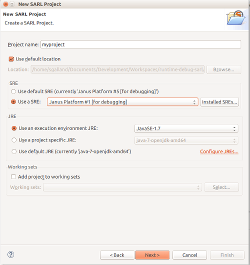
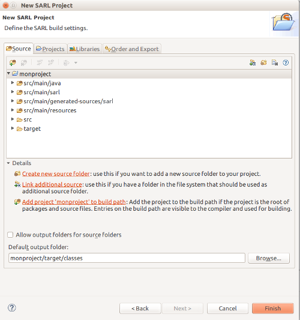

# Create your First Project


<ul class="page_outline" id="page_outline">

<li><a href="#1-create-a-sarl-project-without-maven">1. Create a SARL Project without Maven</a></li>
<ul>
  <li><a href="#1-1-step-1-entering-the-project-information">1.1. Step 1: Entering the project information</a></li>
  <li><a href="#1-2-step-2-configuration-of-the-source-folders">1.2. Step 2: Configuration of the source folders"</a></li>
</ul>
<li><a href="#2-create-a-sarl-project-with-maven">2. Create a SARL Project with Maven</a></li>
<ul>
  <li><a href="#2-1-edit-the-maven-configuration">2.1. Edit the Maven configuration</a></li>
  <li><a href="#2-2-configuration-of-a-runtime-environment-optional">2.2. Configuration of a runtime environment (optional)</a></li>
</ul>
<li><a href="#3-what-s-next">3. What's next?</a></li>
<li><a href="#4-legal-notice">4. Legal Notice</a></li>

</ul>


For developing with SARL, you should create a project. This document describes two ways for created SARL projects.

Two ways are available for creating a SARL project:
1. creating a SARL project inside Eclipse without Maven, or
2. creating a SARL project with Maven (inside or outside Eclipse).

These two ways are explained below.

##1. Create a SARL Project without Maven

For creating a project, you should open your Eclipse and click on **File > New > Projects**, and select *SARL Project* in
the SARL category.


After clicking on **Next**, the wizard is displaying the first page for creating a SARL project.


###1.1. Step 1: Entering the project information

You must enter the name of your project. You could change the standard SARL and Java environment configurations as well.





Then you could click on **Next** for continuing the edition of the project's properties, or simply click on the
**Finish** button for creating the project with the default properties.

The rest of this section is devoted to the edition of the additional properties for the SARL project.


###1.2. Step 2: Configuration of the source folders"

The second page of the wizard contains the building settings. Two tabs are really interesting: the *Source* and the *Libraries*.

The *Source* tab defines the folders in your project that must contains source code files. By default, a SARL project is
composed of four source folders:

* `src/main/java`: for your Java classes;
* `src/main/sarl`: for your SARL scripts;
* `src/main/generated-sources/sarl`: for the Java codes generated by the SARL compiler (you should not change them yourself);
* `src/main/resources`: for the files that are not SARL nor Java code.

The default output folder is `target/classes`.

<note>The names of these folders are following the conventions of a Maven-based project (described below). In this way, you will
be able to turn the Maven nature on your SARL project on/off.</note>



##2. Create a SARL Project with Maven

For creating a project with both the Maven and SARL natures, you should open your Eclipse and click on
**File > New > Others > Maven > Maven Project**.

Follow the steps of the project creation wizard, and finally click on the **Finish** button.

###2.1. Edit the Maven configuration

Open the file `pom.xml`, and edit it for obtaining a content similar to the configuration below.

Replace the version number `0.6.0-SNAPSHOT` of SARL with the one you want to use. You could search on the
[Maven Central Repository](http://central.sonatype.org/) for the last available version.

```xml
 <project>
    ...
    <properties>
       ...
       <sarl.version>0.6.0-SNAPSHOT</sarl.version>
    </properties>
    ...
    <build>
       <plugins>
          ...
          <plugin>
             <groupId>io.sarl.maven</groupId>
             <artifactId>sarl-maven-plugin</artifactId>
             <version>${sarl.version}</version>
             <extensions>true</extensions>
             <configuration>
                <source>1.8</source>
                <target>1.8</target>
                <encoding>UTF-8</encoding>
             </configuration>
          </plugin>
       </plugins>
    </build>
    ...
    <dependencies>
      ...
       <dependency>
          <groupId>io.sarl.maven</groupId>
          <artifactId>io.sarl.maven.sdk</artifactId>
          <version>${sarl.version}</version>
       </dependency>
       ...
    </dependencies>
    ...
 </project>
```


The Maven configuration is based on the use of `sarl-maven-plugin`. This plugin is in charge of compiling the SARL and
the Java files.

<important>You must set the `extensions` tag to true for the `sarl-maven-plugin` plugin. If you missed to set it, the plugin
will not able to be integrated in the Maven life-cycle. The consequence will be that only the Java compiler will be
invoked.</important>

###2.2. Configuration of a runtime environment (optional)

For executing your SARL program, you must use a [runtime environment](http://www.sarl.io/runtime/index.html).

The runtime environment that is recommended by the developers of SARL is [Janus](http://www.janusproject.io). 

In several specific cases, you may want to include the runtime environment into the Maven dependencies of your project. In
this case, you could replace the Maven dependency to the SARL sdk (as defined in the previous section) by a Maven dependency
to the runtime environment.

Replace the version number (`0.6.0-SNAPSHOT`) of the [Janus platform](http://www.janusproject.io) with the one you want to use.
You could search on the [Maven Central Repository](http://central.sonatype.org/) for the last available version.


```xml
 <project>
   ...
    <properties>
       ...
       <janus.version>0.6.0-SNAPSHOT</janus.version>
    </properties>
    ...
    <build>
       <plugins>
          ...
          <plugin>
             <groupId>io.sarl.maven</groupId>
             <artifactId>sarl-maven-plugin</artifactId>
             <version>${sarl.version}</version>
             <extensions>true</extensions>
             <configuration>
                <source>1.8</source>
                <target>1.8</target>
                <encoding>UTF-8</encoding>
             </configuration>
          </plugin>
       </plugins>
    </build>
    ...
    <dependencies>
       ...
       <dependency>
          <groupId>io.janusproject</groupId>
          <artifactId>io.janusproject.kernel</artifactId>
          <version>${janus.version}</version>
       </dependency>
       ...
    </dependencies>
    ...
 </project>
```


<important>If you want to have the dependencies to both `io.sarl.maven.sdk` and `io.janusproject.kernel` in your
POM file, you must be sure that the imported version of the Google Guava library is the one provided by the Janus
platform. For ensuring this, you must specify the version of the Guava library by defining it in the "dependencyManagement"
section of your pom file.</important>

##3. What's next?

In the next section, we will learn how to create our first agent.

[Next>](./AgentIntroduction.html)

##4. Legal Notice

* Specification: SARL General-purpose Agent-Oriented Programming Language ("Specification")
* Version: 0.6
* Status: Draft Release
* Release: 2017-05-11

> Copyright &copy; 2014-2017 [the original authors or authors](http://www.sarl.io/about/index.html).
>
> Licensed under the Apache License, Version 2.0;
> you may not use this file except in compliance with the License.
> You may obtain a copy of the [License](http://www.apache.org/licenses/LICENSE-2.0).
>
> You are free to reproduce the content of this page on copyleft websites such as Wikipedia.

<small>Generated with the translator io.sarl.maven.docs.generator 0.6.0-SNAPSHOT.</small>