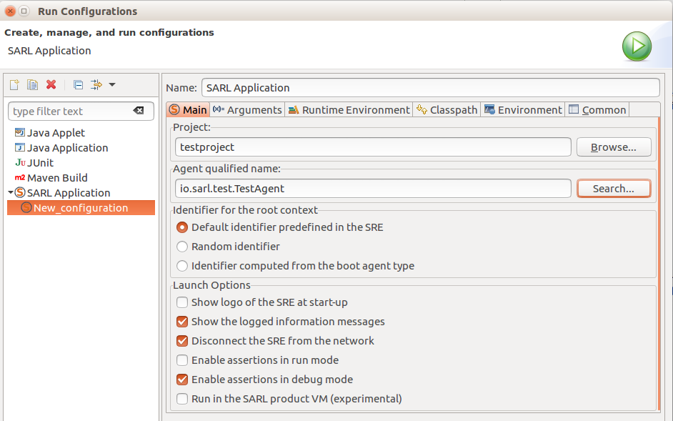
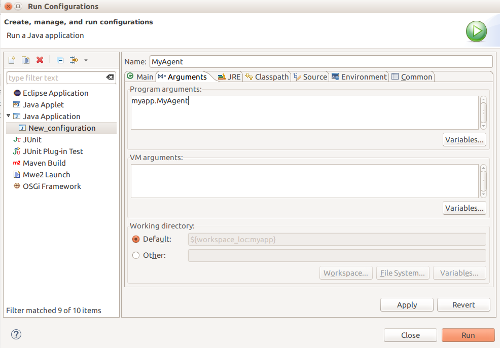

# Run SARL Agent in the Eclipse IDE


<ul class="page_outline" id="page_outline">

<li><a href="#1-create-a-sarl-launch-configuration">1. Create a SARL Launch Configuration</a></li>
<ul>
  <li><a href="#1-1-create-a-java-application-configuration">1.1. Create a Java application configuration</a></li>
  <li><a href="#1-2-specify-the-agent-to-execute">1.2. Specify the agent to execute</a></li>
  <li><a href="#1-3-add-the-janus-runtime-environment">1.3. Add the Janus runtime environment</a></li>
  <li><a href="#1-4-give-parameters-to-the-agent">1.4. Give parameters to the Agent</a></li>
</ul>
<li><a href="#2-create-a-java-launch-configuration">2. Create a Java Launch Configuration</a></li>
<ul>
  <li><a href="#2-1-create-a-java-application-configuration">2.1. Create a Java application configuration</a></li>
  <li><a href="#2-2-add-the-janus-runtime-environment">2.2. Add the Janus runtime environment</a></li>
  <li><a href="#2-3-specify-the-janus-boot-agent">2.3. Specify the Janus Boot agent</a></li>
  <li><a href="#2-4-specify-the-agent-to-execute">2.4. Specify the agent to execute</a></li>
  <li><a href="#2-5-give-parameters-to-the-agent">2.5. Give parameters to the Agent</a></li>
</ul>
<li><a href="#3-retrieve-the-command-line-parameters-in-the-agent">3. Retrieve the Command Line Parameters in the Agent</a></li>
<li><a href="#4-what-s-next">4. What's next?</a></li>
<li><a href="#5-legal-notice">5. Legal Notice</a></li>

</ul>


For running an agent, you must launch this agent on the runtime environment.
In this document, we assume that the runtime environment is the [Janus platform](http://www.janusproject.io).

Two major methods are available for launching a SARL application inside the SARL Eclipse IDE:

* Use a [SARL launch configuration](#create_a_sarl_launch_configuration).
* Use a [Java launch configuration](#create_a_java_launch_configuration).

The SARL launch configuration is recommended.


##1. Create a SARL Launch Configuration

For launching the SARL agents on the runtime environment inside the SARL Eclipse IDE, you must
define a *Run Configuration*.

<veryimportant>If your project is Maven-based, you could not use this method for launching your
application. You must use the [Java launch configuration](#create_a_java_launch_configuration).</veryimportant>


###1.1. Create a Java application configuration

Open the run configuration dialog box by selecting **Run > Run Configurations**, and create a new SARL
application. You obtain a page similar to:


Change the *name* of the run configuration, and select the *project*, which is containing your agent.

###1.2. Specify the agent to execute

The second step is the specification of the agent to launch.
Keep in mind that you can only give one start-up agent to 
the runtime environment. The other agents will be spawned by the
specified start-up agent.

The start-up agent is given in the *Agent qualified name* field of
the *Main* tab. You must enter the fully qualified name
of the agent that must be launched. 





At the bottom of this page, you may change configuration options for the runtime environment.

###1.3. Add the Janus runtime environment

For running your agent, you must specify a SARL runtime environment.
In this tutorial, we assume that you want to use the [Janus platform](http://www.janusproject.io).

If you don't want to use the Janus platform, you must download the
runtime environment that you want to use, and install it in the SARL Eclipse environment as follow.
You add a **SARL runtime environment** (or SRE) in
the *Runtime environment* tab. You should click on the **Installed SREs** button for
managing the installed runtime environments (or open the corresponding preference page).
After adding the SRE's JAR file, you obtain a dialog box similar to:


###1.4. Give parameters to the Agent

It is possible to give arguments to the launched agent.
Indeed, all the arguments given as program arguments
are put in the `parameters` attribute of the `Initialize` event.
This event is fired when the launched agent is started.


The following example gives the values `FirstArgument` and
`SecondArgument` to the launched agent:


On this page, you could also specify the parameters to give to the SARL runtime environment or
to the Java virtual machine.


##2. Create a Java Launch Configuration

For launching the SARL agents on the Janus runtime environment inside
the Eclipse IDE, you must define a *Run Configuration*.


This section is dedicated to the definition of a launcher for Java application (the standard and classical
launching configuration in the Eclipse community).


###2.1. Create a Java application configuration

Open the run configuration dialog box by selecting **Run > Run Configurations**, and create a new Java
Application. You obtain a page similar to:


Change the *name* of the run configuration, and select the *project*, which is containing your agent.


###2.2. Add the Janus runtime environment

For running your agent with the Janus runtime environment, you must add the Janus library in the class path.

For adding the Janus library, select the **Classpath** tab, and **User Entries**.
Click on the **Advanced** button. You will be able to select the type of classpath
entry to add. Select "Add Library". 


Then, you are able to select the library for the Janus runtime environment. 


###2.3. Specify the Janus Boot agent

You can go back to the *Main* tab, and enter the *Main class*.
The main class **must always be** `io.janusproject.Boot`.


###2.4. Specify the agent to execute

The last step is the specification of the agent to launch.
Keep in mind that you can give to the Janus runtime environment
only one start-up agent. The other agents will be spawn by the
specified start-up agent.


The start-up agent is given in the *Program arguments* field of
the *Arguments* tab. You must enter the fully qualified name
of the agent that must be launched. 





###2.5. Give parameters to the Agent

It is possible to give arguments to the launched agent.
Indeed, all the arguments given as program arguments
are put in the `parameters` attribute of the `Initialize` event.
This event is fired when the launched agent is started.


The following example gives the values `FirstParam` and
`SecondParam` to the launched agent:


##3. Retrieve the Command Line Parameters in the Agent

For retrieving the values passed on the command line, you must handle the `Initialize` event, as illustrated
by the following example:

```sarl
agent MyAgent {
	uses Logging
	on Initialize {
		println("Command line parameters: " + occurrence.parameters)
	}
}
```


##4. What's next?

In the next section, we will learn how to launch your SARL project from the command line.


[Next>](./RunSARLAgentCLI.html)


##5. Legal Notice

* Specification: SARL General-purpose Agent-Oriented Programming Language ("Specification")
* Version: 0.6
* Status: Draft Release
* Release: 2017-05-11

> Copyright &copy; 2014-2017 [the original authors or authors](http://www.sarl.io/about/index.html).
>
> Licensed under the Apache License, Version 2.0;
> you may not use this file except in compliance with the License.
> You may obtain a copy of the [License](http://www.apache.org/licenses/LICENSE-2.0).
>
> You are free to reproduce the content of this page on copyleft websites such as Wikipedia.

<small>Generated with the translator io.sarl.maven.docs.generator 0.6.0-SNAPSHOT.</small>