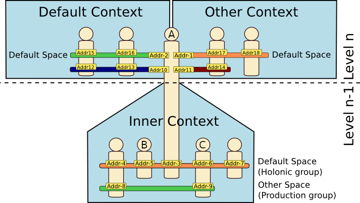

# Built-in Capacity Reference

<ul class="page_outline" id="page_outline">

<li><a href="#1-details-on-the-built-in-capacities">1. Details on the Built-In Capacities</a></li>
<li><a href="#2-use-of-the-built-in-capacities">2. Use of the Built-in Capacities</a></li>
<li><a href="#3-version-specification">3. Version Specification</a></li>
<li><a href="#4-legal-notice">4. Legal Notice</a></li>

</ul>

This document describes the built-in capacities in SARL.
Before reading this document, we recommend that you read
the [Expression Syntax Reference](../expr/index.html), the [Capacity Reference](./Capacity.html),
and the [Skill Reference](./Skill.html).

A *Capacity* is the specification of a collection of actions. This specification makes no assumptions about
its implementation. It could be used to specify what an agent can do, what a behavior requires for its execution.

A *Skill* is a possible implementation of a capacity fulfilling all the 
 * constraints of this specification.

In SARL, every agent has a set of *built-in capacities* considered essential 
to respect the commonly accepted competencies of agents.
These capacities are considered the main building blocks on top of which other 
higher level capacities and skills can be constructed.
They are defined in the SARL language, but the skills implementing them are provided 
by the runtime environment, e.g. the [Janus platform](http://www.sarl.io/runtime/janus/).
This runtime environment is responsible for creating them and injecting them in 
the agent before their execution begins.
Therefore, when the agent receives the `Initialize` event they are
already available.

The following figure presents the different contexts associated to an agent `A`.
Several built-in capacities permit accessing and manage these contexts.
The agents are represented by stylized humans, the contexts by the blue boxes,
and the spaces by the small color boxes in the contexts.

## 1. Details on the Built-In Capacities

Each built-in capacity is detailed inside a dedicated section:

* [Behaviors](./Behaviors.html)
* [DefaultContextInteractions](./DefaultContextInteractions.html)
* [ExternalContextAccess](./ExternalContextAccess.html)
* [InnerContextAccess](./InnerContextAccess.html)
* [Lifecycle](./Lifecycle.html)
* [Logging](./Logging.html)
* [Schedules](./Schedules.html)
* [Time](./Time.html)

## 2. Use of the Built-in Capacities

Details on the use of the built-in capacities may be found in the references of the major
behavior-based concepts of SARL:

* [Agent](./Agent.html)
* [Behavior](./Behavior.html)
* [Skill](./Skill.html)

## 3. Version Specification

* Specification: SARL General-purpose Agent-Oriented Programming Language ("Specification")
* Version: 0.15
* Status: Stable Release
* Release: 2025-09-10

## 4. Legal Notice

> Copyright &copy; 2014-2025 [SARL.io, the Original Authors and Main Authors](http://www.sarl.io/about/index.html).
>
> Documentation text and medias are licensed under the Creative Common CC-BY-SA-4.0;
> you may not use this file except in compliance with CC-BY-SA-4.0.
> You may obtain a copy of [CC-BY-4.0](https://creativecommons.org/licenses/by-sa/4.0/deed.en).
>
> Examples of SARL code are licensed under the Apache License, Version 2.0;
> you may not use this file except in compliance with the Apache License.
> You may obtain a copy of the [Apache License](http://www.apache.org/licenses/LICENSE-2.0).
>
> You are free to reproduce the content of this page on copyleft websites such as Wikipedia.

<small>Generated with the translator docs.generator 0.15.0.</small>
