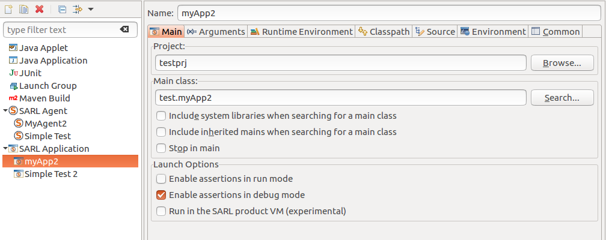

# Assertion Support

An assertion is a statement that a predicate is expected to always be true at that point in the code.
If an assertion evaluates to false at run time, an assertion failure results, which typically causes
the program to crash, or to throw an assertion exception.

## 1. Assert Statement

SARL supports assertions in the source code by the `assert` keyword.

```sarl
assert someCondition
```


The `someCondition` expression is the Boolean expression that is dynamically evaluated.
For example, in the following code, the two first `assert` have their conditions evaluated to true, and do not stop the program.
The third `assert` condition is evaluated to false. It causes a stop of the program.

```sarl
x = 1
assert x > 0
x++
assert x > 1
assert x <= 1
```


## 2. Error Message

Sometimes, it is useful to give an explanation about the failure.
The `assert` keyword accepts a string of character that is the message given when the program has crashed.
The message string follows the condition, with a coma character between them.

```sarl
assert someCondition, "the failure explanation is here"
```


		
# Enable and Disable Assertions.

By default, assertions are disabled. It means that they are not evaluated at run-time.
In this way, if someone is launching your application, the application is running quickly, and
the assert errors cannot occur. It is compliant with the fact that assertions are tests by and for
the application's developers: the final user of the application is not care about the implementation
constraints.

For enabling and disabling the assertions, you must change the launch configuration within the SARL product,
or use an option that is provided by the SARL run-time environment.

## 3. Inside the SARL Development Environment

Within the SARL development environment, you must define a launch configuration for running a SARL application.
Two launch configurations are available:
* "SARL Agent" for launching an agent, and
* "SARL Application" for launching a standard application (based on the definition of a `main` method), which will launch the SARL framework later. 

Both of these launch configurations allow you to enable or disable the assertions.
On the figure below, you could see the "Enable assertions in run mode" and "Enable assertions in debug mode"
checkboxes within the "Launch Options" section.
If the first (resp. second) box is checked, assertions will be enabled when you application was launched in run (resp. debug) mode. 



## 4. Launching the Janus framework

The Janus framework is one implementation of a SARL run-time environment. You have to use one of its command-line
options for enabling assertions. All the command-line options are detailed on a [dedicated page](../../tools/Janus.html).
Usually, the option for enabling the assertions is the same as the one of the Java virtual machine: -ea.

## 5. Launching the Java virtual machine

If you want to run your SARL application by launching the Java virtual machine, you could use the standard command
line options `-enableassertions` and `-ea` that are provided by this virtual machine:

```text
java [ -enableassertions | -ea  ] <class name>
```


## 6. References

This documentation is based on documentations from the Xtext and Xtend projects, and from the Java tutorials.
Thank you to the contributors to these documents.

* [Xtend](https://www.eclipse.org/xtend/documentation.html)
* [Xtext](https://www.eclipse.org/Xtext/documentation.html)
* [Java Tutorials](https://docs.oracle.com/javase/tutorial/)

## 7. Version Specification

* Specification: SARL General-purpose Agent-Oriented Programming Language ("Specification")
* Version: 0.15
* Status: Stable Release
* Release: 2025-09-11

## 8. Legal Notice

> Copyright &copy; 2014-2025 [SARL.io, the Original Authors and Main Authors](http://www.sarl.io/about/index.html).
>
> Documentation text and medias are licensed under the Creative Common CC-BY-SA-4.0;
> you may not use this file except in compliance with CC-BY-SA-4.0.
> You may obtain a copy of [CC-BY-4.0](https://creativecommons.org/licenses/by-sa/4.0/deed.en).
>
> Examples of SARL code are licensed under the Apache License, Version 2.0;
> you may not use this file except in compliance with the Apache License.
> You may obtain a copy of the [Apache License](http://www.apache.org/licenses/LICENSE-2.0).
>
> You are free to reproduce the content of this page on copyleft websites such as Wikipedia.

<small>Generated with the translator docs.generator 0.15.1.</small>
