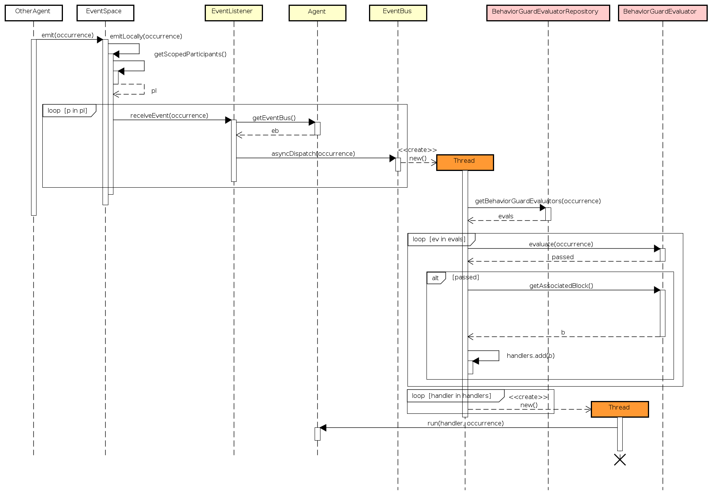
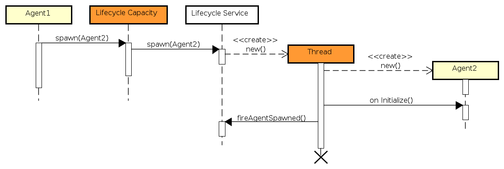

# Run-time Behavior of SARL Programs


<ul class="page_outline" id="page_outline">

<li><a href="#1-definition-sarl-run-time-environment-sre">1. Definition: SARL Run-time Environment (SRE)</a></li>
<li><a href="#2-sequential-vs-parallel-execution">2. Sequential vs. Parallel Execution</a></li>
<li><a href="#3-general-principles-related-to-the-parallel-execution-within-agents">3. General Principles Related to the Parallel Execution within Agents</a></li>
<li><a href="#4-event-handling-run-time-sequence">4. Event Handling Run-time Sequence</a></li>
<ul>
  <li><a href="#41-event-handling-in-agent">4.1. Event Handling in Agent</a></li>
  <li><a href="#42-event-handling-in-behavior">4.2. Event Handling in Behavior</a></li>
</ul>
<li><a href="#5-code-synchronization-in-sarl">5. Code Synchronization in SARL</a></li>
<ul>
  <li><a href="#51-why-synchronization">5.1. Why Synchronization?</a></li>
  <li><a href="#52-the-synchronized-keyword">5.2. The Synchronized Keyword</a></li>
</ul>
<li><a href="#6-event-sending-run-time-sequence">6. Event Sending Run-time Sequence</a></li>
<li><a href="#7-agent-spawning-run-time-sequence">7. Agent Spawning Run-time Sequence</a></li>
<li><a href="#8-agent-killing-run-time-sequence">8. Agent Killing Run-time Sequence</a></li>
<li><a href="#9-legal-notice">9. Legal Notice</a></li>

</ul>


This page provides the key elements for understanding the operational semantic of the SARL programs.

## 1. Definition: SARL Run-time Environment (SRE)

The SARL Run-time Environment (SRE) is part of the [SARL toolchain](../compilation/Basics.html).
An SRE is a collection of tools that enables the run of an agent-based application written with SARL.
Such an SRE must implement each service and feature that are assumed to be provided by the run-time
environment for running a SARL program.


When the target platform is Java-based, the SRE is composed by a standard Java Runtime Environment (JRE),
and the [Janus Java library](../tools/Janus.html), which provides the base classes for running  agents written
with SARL. In this latest example, a command-line tool is provided for launching the Janus platform:
  [janus](../tools/Janus.html).

## 2. Sequential vs. Parallel Execution

Except for the cases that are explained on this page, all the instructions and statements of a SARL program are run sequentially,
as for most of the other programming languages such as Java.
Consequently, the expressions such as `while`, `if`, `switch`, run sequentially. There should be no difference with
your knowledge in procedural programming or object-oriented programming.

The elements that are run asynchronously, i.e. in parallel are explained in the rest of this page.

## 3. General Principles Related to the Parallel Execution within Agents

Let an *agent entry point* be a part of the agent behavior that is reacting to a stimulus from the outside of the agent.
In SARL, the entry points are by default the behavior event handlers, a.k.a. behavior units, specified with the `on` keyword,
as illustrated below:

```sarl
agent AgentExample {
	on MyEvent {
		// Do something
	}
	on MyEvent {
		// Do another thing
	}
}
```


To implement bio-inspired behaviors, agents may react in parallel to multiple external stimuli.
SARL encourages a massively parallel execution of agents and behaviors by **associating each of these entry points to a separate execution
resource, a.k.a. thread**.

Parallel execution of the pro-active behaviors of an agent is supported by the tasks that are launched with the [Schedules](./bic/Schedules.html)
built-in capacity.


In most of the agent frameworks, e.g. [Jade](https://jade.tilab.com/) and [Janus](../tools/Janus.html) (before its adaptation to SARL),
each agent runs on a separate thread.
This design choice enables each agent managing its own execution resource, and
participating to its autonomy. On several other platforms, e.g. [TinyMAS](http://www.arakhne.org/tinymas), the agents are executed
in turn in a loop. The parallel execution of the agents is therefore simulated.


Whatever the agent execution mechanism that is implemented within the SRE (thread-based or loop-based), a SARL developer always assumes
that the agent's entry points are executed in parallel when she/he is writing the event handlers.

## 4. Event Handling Run-time Sequence

According to the general principles of parallel execution that are explained into the previous section, each time an event is received
by an agent, this event must be treated in a parallel process.
The rest of this section describes the run-time behavior that is applied when handling the events within a SARL program.

### 4.1. Event Handling in Agent

In order to illustrate the run-time behavior of a SARL agent when handling an event, two illustrative examples are explained as well as
the implemented general algorithm.

#### Single Event Handler

Let consider the following agent definition:

```sarl
agent Agent1 {
	on MyEvent {
        println("A")
	}
	on MyEvent2 {
	}
}
event MyEvent
event MyEvent2
```


This agent definition contains two event handlers: one for events of type `MyEvent`, and one for events of type `MyEvent2`.
The sequence diagram that corresponds to the sending and receiving of an occurrence of type `MyEvent` by `Agent1` is provided below.


The different steps of the process are (please note that this process is not the really implemented into the SRE; See below for the implemented general process):

1. An agent (that may be the `Agent1` or not) emits an event of type `MyEvent` by calling an `emit()` function within
an event space (this part of the API is not detailed in this section).
2. The event space retrieves all the participants (either marked as strong or weak) and loop on each of them (named `p`). Each participant is an object of type `EventListener`.
3. For each participant, the event delivering function `receiveEvent()` is invoked:
   1. The event listener retrieves the event bus of `Agent1`. The event bus is an internal object that is in charge of routing the events to the different objects that were registered as waiting events within the agent (at least the agent itself).
   2. The event is dispatched asynchronously by the event bus.
      * Because there is only one event handler for events of type `MyEvent`, only one thread is created for running the associated block of code.
      * The thread is in charge of running the block of code on the current event occurrence.


#### Double Event Handlers

It is also possible to define multiple event handlers into an agent definition, as illustrated by the following SARL code:

```sarl
agent Agent2 {
	on MyEvent {
        println("A")
	}
	on MyEvent {
        println("B")
	}
	on MyEvent2 {
	}
}
```


This agent definition contains three event handlers: two for events of type `MyEvent`, and one for events of type `MyEvent2`.
The sequence diagram that corresponds to the receiving of an occurrence of type `MyEvent`  by `Agent2` is provided below:


The process is similar to the process that is described above for the single event handler example.
The difference is related to the number of threads that are created: one for each event handler defined into `Agent2`. 


#### Inheritance of Event Handlers

When the agent definition extends another agent definition, as illustrated by the following SARL code, the event handlers are inherited.

```sarl
agent SubAgent2 extends Agent2 {
	on MyEvent {
        println("C")
	}
	on MyEvent {
        println("D")
	}
}
```


In the previous code, two event handlers are added into the definition of `SubAgent2`.
These two event handlers are added to the list of available event handlers for the event `MyEvent`.
Therefore, the agent `SubAgent2` displays `A` and `B` from the inherited definition of `Agent2`, and `C`
and `D` from the `SubAgent2` definition.
And, because of the parallel execution of the four event handlers, there is no fixed order for displaying `A`, `B`, `C`, `D`.

<p markdown="1"><span class="label label-danger">Caution</span> Event handlers are inherited, but there is no overriding of event handler. In other words, you cannot replace/override the code of an event handler that is inherited.</p>


#### General Process for Event Handling

Finally, the general process for event handling must supports any number of event handlers.
Additionally, it is possible to specify a guard for each event handler. This guard is evaluated when the occurrence of the event is received
in order to determine if the associated block of code should be executed, or not.
The sequence diagram bellow illustrates the algorithm for general event handling into the agents. 



It is similar to the two examples that are presented above.
It is interesting to note that the function `asyncDispatch()` of the event bus is run asynchronously, i.e. in a separate thread.
In this way, the agent that is sending the event is not blocked by the event dispatching process.

Let n be the number of participants within an event space, and m be the average number of event handlers per participant.
The number of threads that is created by the SRE is: n * (1 + m)

### 4.2. Event Handling in Behavior

A [Behavior](./Behavior.html) is the specification of a collection of behavior units (or event handlers).
An agent may create and register multiple behaviors that should be used/executed in parallel to the agent itself.
The question arising is: how the registered behaviors are receiving the events' occurrences?

Since a behavior must be registered as explained in the [Behaviors built-in capacity](./bic/Behaviors.html), the agent is managing internally
a collection of behaviors.

In the sequence diagram below, you could see that a behavior is created and then registered through the [Behaviors built-in capacity](./bic/Behaviors.html).
The skill implementing the capacity is registering the created behavior as a event listener on the agent's event bus.


## 5. Code Synchronization in SARL

### 5.1. Why Synchronization?

Let's consider a typical race condition where we calculate the sum, and multiple event handlers (i.e. threads) execute the
`Calculate` event:

```sarl
agent AgentExample {
    var sum = 0
	def getSum : int {
		this.sum
	}
	def setSum(v : int) {
		this.sum = v
	}
	on Calculate {
        setSum(getSum + 1)
	}
}
```


Since the event handler is executed in parallel (see previous section), if multiple occurrences of `Calculate` are fired, then a multi-threading issues
for accessing to the `sum` may occur.

Let the firing of `1000` events. If we would execute this serially, the expected output would be `1000`, but our multi-threaded
execution fails almost every time with an inconsistent actual output e.g.: `965`. This result is of course unexpected.

A simple way to avoid the race condition is to make the operation thread-safe by using the `synchronized` keyword.

<p markdown="1"><span class="label label-danger">Caution</span> If a field is assessed from a function called from an event handler, then the synchronization issue still may occur, if neither the function is synchronized nor the event handler.</p>


### 5.2. The Synchronized Keyword

The `synchronized` keyword is included into the SARL language in order to let you control how your program is synchronizing the
accesses to shared data.
This keyword is formally defined in a dedicated [reference page](./general/Synchronization.html).

<p markdown="1"><span class="label label-danger">Caution</span> The SARL compiler does not apply automatic synchronization to your code yet (it is planned for a future release). You have to manage the `synchronized` keyword manually by yourself.</p>


## 6. Event Sending Run-time Sequence

One of the key features of a SARL program is related to the exchange of events.
In the previous sections, we have discussed the run-time behavior when receiving of the events.
Regarding the sending of the events, SARL provides [built-in capacities](./BIC.html) that assume the sending is done asynchronously.
In other words, as soon as an agent is invoking the event sending function, the SRE starts a task in parallel for delivering the event.

In the sequence diagram of the general event dispatching process, above, you could see that the call to the `emit()` function is
limit to the strictly necessary code for initiating the event dispatching into all the participants of an event space.
Therefore, a thread is creating as soon as possible for proceeding the concrete dispatching.


## 7. Agent Spawning Run-time Sequence

Agent spawning is the action for creating instances of agents into the SRE.
The spawning is supported by the [Lifecycle built-in capacity](./bic/Lifecycle.html) that provides a collection of `spawn` functions.
The sequence diagram below illustrates the standard agent spawning process.



It is important to note that the initial `spawn()` function returns quickly, and most of the time, before the agent is really created and
added into the SRE.
It is due to the thread that is created by the SRE's life-cycle service for supporting the agent creation and initialization process.

You have also to note that the initialization event handler, i.e. `on Initialize`, into the created agent is executed synchronously.
In this way, it is sure the new agent is totally initialized when the `AgentSpawned` events are fired for notifying the other agents about
the agent creation. 

## 8. Agent Killing Run-time Sequence

Agent killing is the action that initiated by an agent for committing a suicide.
This action is supported by the [Lifecycle built-in capacity](./bic/Lifecycle.html) that the `killMe` function.
The sequence diagram below illustrates the standard agent killing process.


Because the `killMe` function never returns from its call, it is not necessary to created a separate thread for not-blocking the `killMe`
caller. That's why in the sequence diagram above, there is no creation of a thread.


## 9. Legal Notice

* Specification: SARL General-purpose Agent-Oriented Programming Language ("Specification")
* Version: 0.12
* Status: Draft Release
* Release: 2020-11-25

> Copyright &copy; 2014-2020 [the original authors or authors](http://www.sarl.io/about/index.html).
>
> Licensed under the Apache License, Version 2.0;
> you may not use this file except in compliance with the License.
> You may obtain a copy of the [License](http://www.apache.org/licenses/LICENSE-2.0).
>
> You are free to reproduce the content of this page on copyleft websites such as Wikipedia.

<small>Generated with the translator io.sarl.maven.docs.generator 0.12.0-SNAPSHOT.</small>
