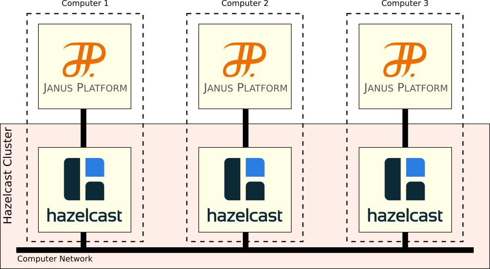

# Extending the Janus SRE with Network Connection


<ul class="page_outline" id="page_outline">

<li><a href="#1-general-principles-of-the-extension">1. General Principles of the Extension</a></li>
<li><a href="#2-maven-inclusion">2. Maven Inclusion</a></li>
<li><a href="#3-configuration-of-the-plugin">3. Configuration of the plugin</a></li>
<li><a href="#4-version-specification">4. Version Specification</a></li>
<li><a href="#5-legal-notice">5. Legal Notice</a></li>

</ul>


[Janus](http://www.sarl.io/runtime/janus/) is an open-source multi-agent platform fully implemented in SARL. 
Janus could be used as an agent-oriented platform, an organizational platform, and/or an holonic platform. 
It also natively manages the concept of recursive agents and holons.
Janus platform was initially published during the 2007-2008 period as a pure Java framework. Since 2014, Janus is fully reimplemented to
support the SARL Agent-Oriented Programming Language. And since 2020, it is fully re-implemented using the SARL language.

Janus implementation follows the standards of software engineering as much as possible. Basically, the key
implementation choices of Janus that are under interest in this tutorial are:
1. [*Microkernel architecture*](http://www.fipa.org/repository/standardspecs.html): Janus implementation is based on a microkernel that provides the key features of an agent framework, and that could be easily extended. The key features are implemented as services.
2. [*Service-based architecture*](https://en.wikipedia.org/wiki/Service-oriented_architecture): The main features of the Janus framework are implemented as services, e.g. context management, agent lifecycle, logging, etc.
3. [*Dependency Injection*](https://en.wikipedia.org/wiki/Dependency_injection): Modules (and services) are injected into the using objects with [Google Guice](https://github.com/google/guice). It provides support for dependency injection using annotations to configure Java objects. Dependency injection is a design pattern whose core principle is to separate behavior from dependency resolution.


By default, Janus does not provide a support for exchanging events over a computer
network. For enabling this communication feature, a specific Janus extension is needed.

This documentation page describes the extension `janus.network` that adds the communication
among Janus nodes over a computer network.

The extension described on this page was defined according to the [standard method for extending Janus](../tutorials/runtime/SreExtension.html).

## 1. General Principles of the Extension

Basically, the networking feature of the Janus SRE enables you to launch instances of the Janus kernel on different
computers, and exchange events between these instances.



In order to implement this feature, the [Hazelcast](http://www.hazelcast.com) library is used.
Hazelcast is an open source in-memory data grid based on Java. In a Hazelcast grid, data is
evenly distributed among the nodes of a computer cluster, allowing for horizontal scaling of
processing and available storage. Backups are also distributed among nodes to protect against
failure of any single node.

In addition to the data-sharing and efficient communication means, Hazelcast provides the ability
to build the node network automatically. Each Hazelcast node that is associated to a given cluster
name is *connected automatically* to the other nodes in the same cluster on the local network.
It means that you do not need to provide a network configuration to the Janus SRE.


## 2. Maven Inclusion

In order to include the networking extension into your project, you could add the following Maven dependency.

```xml
 <project>
   ...
    <properties>
       ...
       <janus.version>3.0.15.0</janus.version>
    </properties>
    ...
    <dependencies>
       ...
       <dependency>
          <groupId>io.sarl.sre.janus</groupId>
          <artifactId>janus.network</artifactId>
          <version>${janus.version}</version>
       </dependency>
       ...
    </dependencies>
    ...
 </project>
```


The `janus.network` maven module provides the network extension **AND** all the libraries related to the Janus SRE.


## 3. Configuration of the plugin

The following table provides a short description of the configuration parameters that are related to this networking
extension.
More details could be obtain by calling your Janus-based software with the command-line option `-H` for example.


| Section | Property | Type | Description |
| ------- | -------- | ---- | ----------- |
| srenetwork |  |  | Configuration for the SRE networking feature |
|  | enable | boolean | Enable or disable the networking features. |
|  | localHazelcastInstance | boolean | Enable or disable the local Hazelcast instance. |
|  | clusterMemberIPs | string | Specify the list of the IP adresses for the members that are allowed to be in the cluster. This configuration is used only if the join method is configured to TCP/IP. |
|  | clusterName | string | Name of the Hazelcast cluster. By default, this name is based on the identifier of the agent root context. |
|  | joinMethod | *"multicast"* &#124; *"tcp_ip"* | Specify the method for joining the Hazelcast cluster over the computer network |
|  | minClusterSize | int | Specify the minimal number of nodes to wait for starting in the cluster before really launching the SARL Run-time Environment |
|  | portAutoIncrement | boolean | Enable or disable the auto-incrementation of the Hazelcast port numbers. |


## 4. Version Specification

* Specification: SARL General-purpose Agent-Oriented Programming Language ("Specification")
* Version: 0.15
* Status: Stable Release
* Release: 2025-09-10

## 5. Legal Notice

> Copyright &copy; 2014-2025 [SARL.io, the Original Authors and Main Authors](http://www.sarl.io/about/index.html).
>
> Documentation text and medias are licensed under the Creative Common CC-BY-SA-4.0;
> you may not use this file except in compliance with CC-BY-SA-4.0.
> You may obtain a copy of [CC-BY-4.0](https://creativecommons.org/licenses/by-sa/4.0/deed.en).
>
> Examples of SARL code are licensed under the Apache License, Version 2.0;
> you may not use this file except in compliance with the Apache License.
> You may obtain a copy of the [Apache License](http://www.apache.org/licenses/LICENSE-2.0).
>
> You are free to reproduce the content of this page on copyleft websites such as Wikipedia.

<small>Generated with the translator docs.generator 0.15.0.</small>
