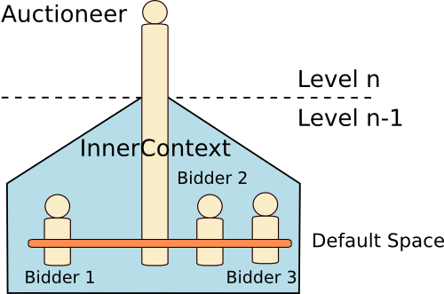

# English Auction with Holons


<ul class="page_outline" id="page_outline">

<li><a href="#1-principle-of-the-english-auction">1. Principle of the English Auction</a></li>
<li><a href="#2-principle-of-the-application">2. Principle of the Application</a></li>
<li><a href="#3-why-are-the-sub-agents-in-the-inner-context">3. Why are the sub-agents in the inner context?</a></li>
<li><a href="#4-definitions-of-the-events">4. Definitions of the events</a></li>
<ul>
  <li><a href="#4-1-price-event">4.1. Price event</a></li>
  <li><a href="#4-2-playing-event">4.2. Playing event</a></li>
</ul>
<li><a href="#5-definition-of-the-bidder">5. Definition of the bidder</a></li>
<ul>
  <li><a href="#5-1-initial-definition">5.1. Initial definition</a></li>
  <li><a href="#5-2-bidding">5.2. Bidding</a></li>
  <li><a href="#5-3-restrict-the-bid-to-the-auctioneer">5.3. Restrict the bid to the auctioneer</a></li>
  <li><a href="#5-4-definition-of-the-auctioneer">5.4. Definition of the auctioneer</a></li>
  <li><a href="#5-5-stop-the-agents">5.5. Stop the agents</a></li>
</ul>
<li><a href="#6-compile-and-launch-the-agents">6. Compile and Launch the agents</a></li>
<ul>
  <li><a href="#6-1-compile-the-code">6.1. Compile the code</a></li>
  <li><a href="#6-2-execute-with-a-runnable-jar">6.2. Execute with a runnable JAR</a></li>
  <li><a href="#6-3-execute-without-a-runnable-jar">6.3. Execute without a runnable JAR</a></li>
</ul>
<li><a href="#7-legal-notice">7. Legal Notice</a></li>

</ul>


This document describes the basics of the creation and design of holons in SARL. This tutorial is applied
on a simple English auction application. Before reading this document, it is recommended reading
the [General Syntax Reference](../reference/GeneralSyntax.html).
The architecture presented in this tutorial may be used for designing a system in which a decision must be
taken after arbitration among components. 

<div class="bt-download">
<a href="http://maven.sarl.io/last-demos-release.jar"></a>
</div>

According to the vocabulary used in the SARL project, all the agents are holons. In the rest of this tutorial,
the terms "agent" and "holon" are synonymous. 

The elements that are explained in this tutorial are:

* the definition of an event;
* the definition of a super-agent;
* the definition of a sub-agent;
* the emit of events from the super-agent to its sub-agent;
* the emit of events from the sub-agent to its super-agent.

<note>The communication between the sub-agents is out of the scope of this tutorial. For interested
readers, the [Agent Reference](../reference/Agent.html) may be read.</note>

The source code related to this tutorial may be found in the
[SARL demos](https://github.com/sarl/sarl-demos/tree/master/src/main/sarl/io/sarl/docs/tutorials/holonicauction).


##1. Principle of the English Auction

This type of auction is arguably the most common form of auction in use today. 
Participants bid openly against one another, with each subsequent bid required to
be higher than the previous bid. An auctioneer may announce prices, bidders
may call out their bids themselves.
The auction ends when no participant is willing to bid further, at which
point the highest bidder pays their bid.
Alternatively, if the seller has set a minimum sale price in advance
(the 'reserve' price) and the final bid does not reach that price the item
remains unsold.
Sometimes the auctioneer sets a minimum amount by which the next bid must
exceed the current highest bid. The most significant distinguishing factor of
this auction type is that the current highest bid is always available to
potential bidders.

Source: [Wikipedia](https://en.wikipedia.org/wiki/Auction)


##2. Principle of the Application

The principle of the application is the following:

* The application is set-up with one auctioneer agent and three bidders agents.
* The auctioneer is announcing the starting price.
* The bidders are offering their bids back.
* When a bid is received, the auctioneer is announcing the new price.
* If there is no received bid, the auctioneer is closing the auction, and the winner is the bidder with the higher bid.

__By a design choice, the bidders are sub-agents of the auctioneer agent.__




##3. Why are the sub-agents in the inner context?

According to the [Built-in Capacity Reference](../reference/BIC.html),
a sub-agent is living in the __inner context__ of a super-agent.
Each agent defines its own context, called the inner context, where other agents can live.
Therefore, every agent can be seen as a part of a larger
[holon](https://en.wikipedia.org/wiki/Holon_(philosophy)) _and_ at the same time be composed 
by other agents that exist in its _inner context_. 

<note> According to the SARL specifications, all the agents in a context belong to
the default space of this context. This property is important
for designing the communication links between two adjacent levels
in the hierarchy of agents. The default space of the inner context
becomes the natural place where the super-agent and
its sub-agents are interacting.</note>


##4. Definitions of the events

In the application, two events are needed: the event from the auctioneer for notifying the
bidders of the new price; and the event that is sent by a bidder to the auctioneer with a
bid inside.


###4.1. Price event

The `Price` event is the event sent by the auctioneer for notifying a bidder that
the price has changed. This event contains the new price.

```sarl
	package io.sarl.docs.tutorials.holonicauction
	event Price {
		val price : float
		new(price : float) {
			this.price = price
		}
	}
```


###4.2. Playing event

The `Bid` event is the event sent by a bidder to the auctioneer.
This event contains the value of the bid.

```sarl
	event Bid {
		val value : float
		new(value : float) {
			this.value = value
		}
	}
```


##5. Definition of the bidder

The bidder agent is reacting to new price notifications, and could offer a new bid if the
new price is not  exceeding its maximal price.


###5.1. Initial definition

The initial definition of the bidder is below. The `random` attribute contains an instance of
a random number generator (from the Java library). The `maxPrice` attribute is the maximum value
of the price that the bidder will consider for bidding.
The bidder selects the maximum price between 100 and 1000 randomly.

```sarl
	agent Bidder {
		val random = new Random
		var maxPrice : float
		
		on Initialize {
			maxPrice = random.nextFloat() * 900f + 100f
		}
	}
```


###5.2. Bidding

The definition of the bidder agent is extended by the bidding behavior.
The bidding must occur when the auctioneer is notifying a new price, i.e. when the
`Price` event is received.
The bidder computes the new price. If this last is not exceeding the maximal
price, then the bidder is sending its bid in a `Bid` event.

<importantnote label="Interaction Principle">
For sending data to its super-agent, a sub-agent must
fire an event in the default space of the inner context
of the super-agent. The `emit` function is supporting this interaction.
</importantnote>

<cautionnote>The `Bid` event is sent in the default space. But there is no
restriction on the event's recipient. It means that the super-agent __and__ the
other sub-agents will receive this event.</cautionnote>

```sarl
	agent Bidder {
		val random = new Random
		var maxPrice : float
		var myLastBid : float
		
		on Initialize {
			maxPrice = random.nextFloat() * 900f + 100f
		}
		
		uses DefaultContextInteractions, Logging
	
		on Price {
			if(occurrence.price == myLastBid) {
				println("I do not bet, I am the winner with :" + myLastBid)
			} else {
				if(occurrence.price < maxPrice) {
					var priceIncrease = random.nextFloat() * 50f
					if (priceIncrease > 0) {
						var newPrice = occurrence.price + priceIncrease
						if (newPrice <= maxPrice) {
							emit(new Bid(newPrice))
							myLastBid = newPrice
						} else {
							println(" I give up, this is beyond my resources : " + myLastBid)
						}
					}
				} else {
					println("I dropped to " + myLastBid)
				}
			}
		}
	}
```


###5.3. Restrict the bid to the auctioneer

For restricting the recipients of the `Bid` event to the auctioneer, it is mandatory to specify a
scope for the event.
For supporting the holonic communication from the sub-agent to the super-agent, the scope
of the event corresponds to the address of the super-agent in the default space.

<note>The ID of the super-agent, and the ID of the inner context of this super-agent are
always the same.</note>

Below, we update the bidding behavior by creating a scope, and providing it to the `emit` function.

```sarl
	agent Bidder {
		val random = new Random
		var maxPrice : float
		var myLastBid : float
		
		on Initialize {
			maxPrice = random.nextFloat() * 900f + 100f
		}
	
		uses DefaultContextInteractions, Logging
	
		on Price {
			if(occurrence.price == myLastBid) {
				println("I do not bet, I am the winner with :" + myLastBid)
			} else {
				if(occurrence.price < maxPrice) {
					var priceIncrease = random.nextFloat() * 50f
					if (priceIncrease > 0) {
						var newPrice = occurrence.price + priceIncrease
						if (newPrice <= maxPrice) {
							var superScope = Scopes.addresses(
								defaultSpace.getAddress(defaultContext.ID))
							emit(new Bid(newPrice), superScope)
							myLastBid = newPrice
						} else {
							println(" I give up, this is beyond my resources : " + myLastBid)
						}
					}
				} else {
					println("I dropped to " + myLastBid)
				}
			}
		}
	}
```


###5.4. Definition of the auctioneer

The third step of this tutorial is the definition of the auctioneer that is initiating
the auction, waiting for bids, and selecting the winner.


#### Initial definition

The initial definition of the auctioneer is defined below. The auctioneer is starting the
auction with a price of 50. It is notifying the bidders with a `Price` event.
Because the bidders are sub-agents, they are living in the inner context of the auctioneer.
For sending the `Price` event to the bidders, the auctioneer must put it in the
default space of its inner context.
This particular type of emit is supported by the `wake` function, which is provided by
the `Behaviors` capacity. This function does the same as:

innerContext.defaultSpace.emit(new Price(50))

<importantnote labe="Interaction Principle">
For sending data to its sub-agents, a super-agent must fire an event in the default space
of its inner context. The `wake` function is supporting this interaction.
</importantnote>

```sarl
	agent Auctioneer {
						
		uses Behaviors
		
		var maxBid = 0f
		var winner : Address
		var hasBid = false 
		var isAuctionOpened = true
		
		on Initialize {
			wake(new Price(50))
		}
	}
```


#### Create the bidders

The creation of the sub-agents in the auctioneer needs to spawn agents in the inner context.
The `Lifecycle` capacity gives the `spawnInContext` function.
This function permits creating an agent in a particular context.
For obtaining the inner context, we need to use the `InnerContextAccess` capacity,
which provides the [:getinner:s] function. Below, we create the three bidders. 

```sarl
	agent Auctioneer {
						
		uses Behaviors, Lifecycle, InnerContextAccess
		
		var maxBid = 0f
		var winner : Address
		var hasBid = false 
		var isAuctionOpened = true
		
		on Initialize {
			for(i : 1..3) {
				spawnInContext(typeof(Bidder), getInnerContext)
			}
			
			wake(new Price(50))
		}
	}
```


#### Receive the bids

The auctioneer is waiting for bids. This behavior is coded inside the behavior
unit dedicated to the `Bid` event. We add a guard on the `isAuctionOpened` attribute
to execute the behavior only if the auction is still opened. We will see later when
the auction is closed. If the value of the received bid is greater than the current
price, the source of the `Bid` event becomes the new potential winner. 

```sarl
	agent Auctioneer {
						
		uses Behaviors, Lifecycle, InnerContextAccess
		
		var maxBid = 0f
		var winner : Address
		var hasBid = false 
		var isAuctionOpened = true
		
		on Initialize {
			for(i : 1..3) {
				spawnInContext(Bidder, innerContext)
			}
			
			wake(new Price(50))
		}
		
		on Bid [ isAuctionOpened ] {
			if (occurrence.value > maxBid) {
				maxBid = occurrence.value
				winner = occurrence.source
			}
		}
	}
```


#### Stop the auction

The auctioneer must wait some time before it is closing the auction due to lake of bid.
To reproduce this behavior, we introduce a periodic task, which is executed every 10
seconds for checking if a bid was provided during the last 10 seconds. This periodic task
is started after the first 10 seconds.

Coding the periodic task in SARL is done with the `Schedules` capacity.
It provides the `every` function that is executing at a fixed delay its second argument,
given by the first argument.
In the task's code, we test if a bid was received. If not, the auctioneer closes the auction,
and outputs the appropriate message. To delay the task executor about the first ten seconds,
we use the `in` function provided by the capacity.

```sarl
	agent Auctioneer {
						
		uses Behaviors, Lifecycle, InnerContextAccess, Schedules, Logging
		
		var maxBid = 0f
		var winner : Address
		var hasBid = false 
		var isAuctionOpened = true
		
		on Initialize {
			for(i : 1..3) {
				spawnInContext(Bidder, innerContext)
			}
			
			wake(new Price(50))
			in(10000) [
				val waitTask = task("wait-task")
				waitTask.every(10000) [
					if (!hasBid) {
						isAuctionOpened = false
						if (winner === null) {
							println("No winner")
						} else {
							println("The winner is " + winner
								+ " with the bid of " + maxBid)
						}
					}
					hasBid = false
				]
			]
		}
		
		on Bid [ isAuctionOpened ] {
			hasBid = true
			if (occurrence.value > maxBid) {
				maxBid = occurrence.value
				winner = occurrence.source
			}
		}
	}
```


#### Synchronize the operations

Because the periodic task and the event handlers may be executed in parallel, we are facing
a classical problem in concurrent programming: how to ensure that two
blocks of code are not executed at the same time for avoiding any conflicting access
on the same data.

It is recommended to "synchronize" the blocks of code. We use the `synchronized` operator
(which has the same meaning as in the Java language). This operator ensures
that two blocks of code, which are synchronized on the
same Object (the argument of the operator) cannot be
executed in parallel by different threads.

```sarl
	agent Auctioneer {
						
		uses Behaviors, Lifecycle, InnerContextAccess, Schedules, Logging
		
		var maxBid = 0f
		var winner : Address
		var hasBid = false 
		var isAuctionOpened = true
		
		on Initialize {
			for(i : 1..3) {
				spawnInContext(Bidder, innerContext)
			}
			
			wake(new Price(50))
			in(10000) [
				val waitTask = task("wait-task")
				waitTask.every(10000) [
					synchronized(this) {
						if (!hasBid) {
							isAuctionOpened = false
							if (winner === null) {
								println("No winner")
							} else {
								println("The winner is " + winner
									+ " with the bid of " + maxBid)
							}
						}
						hasBid = false
					}
				]
			]
		}
		
		on Bid [ isAuctionOpened ] {
			synchronized(this) {
				hasBid = true
				if (occurrence.value > maxBid) {
					maxBid = occurrence.value
					winner = occurrence.source
				}
			}
		}
	}
```


###5.5. Stop the agents

The previous code works well at one exception. When the auction is closed, the system does not stop.
Indeed, the auctioneer does not send any more the `Price` event. This
cause all the agents waiting something that will never append.

__We need to stop the agents.__

<importantnote> In the specification of SARL, a super-agent cannot be killed
if there is some other agent belonging to its inner context.
Consequently, for stopping the agents, we need to stop the
sub-agents before the super-agent.</importantnote>


#### StopAuction event

Because the determination of the end of the agent's life is made by the auctioneer,
this last must notify its sub-agents that it is time to commit a suicide.
We introduce the `StopAuction` event that is used for this particular notification task.

```sarl
	event StopAuction
```


#### Kill the bidder

The code of the bidder must be updated for reacting on the receiving of the `StopAuction`
event.
When it is received, the bidder agent is killing itself by calling the `killMe` function.
This function is provided by the `Lifecycle` capacity.

```sarl
	agent Bidder {
		val random = new Random()
		var maxPrice : float
		
		on Initialize {
			maxPrice = random.nextFloat() * 900f + 100f
		}
	
		uses DefaultContextInteractions
	
		on Price {
			var priceIncrease = random.nextFloat() * 50f
			if (priceIncrease > 0) {
				var newPrice = occurrence.price + priceIncrease
				if (newPrice <= maxPrice) {
					var superScope = Scopes.addresses(
						defaultSpace.getAddress(defaultContext.ID))
					emit(new Bid(newPrice), superScope)
				}
			}
		}
		
		uses Lifecycle
		
		on StopAuction {
			killMe
		}
	}
```


#### Kill the auctioneer

The code of the auctioneer must be updated for firing the `StopAuction` event, and for killing
itself when there is no more sub-agent.
Firstly, the periodic task is updated with a `wake` call
that permits notifying the sub-agents of the end of the auction.
Secondly, in this periodic task, if the auction is closed, then the auctioneer is killing itself if the
`hasMemberAgent` function replies false.
This function is provided by the `InnerContextAccess` capacity.
The periodic task must also be stopped. The `cancel` function is invoked on the periodic task
to stop its execution.

```sarl
	agent Auctioneer {
						
		uses Behaviors, Lifecycle, InnerContextAccess, Schedules, Logging
		
		var maxBid = 0f
		var winner : Address
		var hasBid = false 
		var isAuctionOpened = true
		
		on Initialize {
			for(i : 1..3) {
				spawnInContext(Bidder, innerContext)
			}
			
			wake(new Price(50))
			in(10000) [
				val waitTask = task("wait-task")
				waitTask.every(10000) [
					synchronized(this) {
						if (!isAuctionOpened) {
							if (!hasMemberAgent) {
								waitTask.cancel
								killMe
							}
						} else {
							if (!hasBid) {
								isAuctionOpened = false
								if (winner === null) {
									println("No winner")
								} else {
									println("The winner is " + winner
										+ " with the bid of " + maxBid)
								}
								wake(new StopAuction)
							}
							hasBid = false
						}
					}
				]
			]
		}
		
		on Bid [ isAuctionOpened ] {
			synchronized(this) {
				hasBid = true
				if (occurrence.value > maxBid) {
					maxBid = occurrence.value
					winner = occurrence.source
				}
			}
		}
	}
```


##6. Compile and Launch the agents

The last step of this tutorial is the definition of the launching process.
In the rest of this section, we discuss the use of the
[Janus runtime environment](http://www.janusproject.io) for running the agents.

The Janus platform is designed to launch a single agent at start-up.
Then, this launched agent must spawn the other agents in the system.
This is typically the case in the auction application.

<importantnote>In this section, we explain how to launch the agents from the command line interface.
For launching the agents from the Eclipse IDE, please read
[Run SARL Agent in the Eclipse IDE](../gettingstarted/RunSARLAgentEclipse.html).</importantnote>


###6.1. Compile the code

You must have a file that contains the compiled files of the tutorial, the Janus platform,
and all the needed libraries by SARL and Janus.

You could directly download this file by clicking on
the download icon at the top of this page; or by compiling the source code yourself.

If you download the source code of the [SARL demos](https://github.com/sarl/sarl-demos/), and
compile them with [Maven](http://maven.apache.org), you will obtain a JAR file with all
the mandatory elements inside. This file is located in the `target` folder,
and it has a name similar to `sarl-demos-0.1.0-with-dependencies.jar`.


###6.2. Execute with a runnable JAR

Here, there is two assumptions:

1. The file `sarl-demos-0.1.0-with-dependencies.jar` is execuable, i.e. it can be directly launched by the Java Virtual Machine.
2. From this file, the JVM is launching the Janus bootstrap automatically, i.e. it has a Main-Class set to `io.janusproject.Boot`.

On the command line, you must launch Janus with:

	java -jar sarl-demos-0.1.0-with-dependencies.jar
	     io.sarl.docs.tutorials.holonicauction.Auctioneer

The file `sarl-demos-0.1.0-with-dependencies.jar` is explained above.
The third argument is the qualified name of the agent to launch.


###6.3. Execute without a runnable JAR

In opposite to the previous section, we assume that the file `sarl-demos-0.1.0-with-dependencies.jar`
is not executable. On the command line, you must launch Janus with:

	java -cp sarl-demos-0.1.0-with-dependencies.jar
	     io.janusproject.Boot
	     io.sarl.docs.tutorials.holonicauction.Auctioneer

The file `sarl-demos-0.1.0-with-dependencies.jar` is explained above.
The string `io.janusproject.Boot` specifies the Java class to launch: the Janus bootstrap.
The first argument after the bootstrap is the qualified name of the agent to launch.


##7. Legal Notice

* Specification: SARL General-purpose Agent-Oriented Programming Language ("Specification")
* Version: 0.6
* Status: Draft Release
* Release: 2017-04-21

> Copyright &copy; 2014-2017 [the original authors or authors](http://www.sarl.io/about/index.html).
>
> Licensed under the Apache License, Version 2.0;
> you may not use this file except in compliance with the License.
> You may obtain a copy of the [License](http://www.apache.org/licenses/LICENSE-2.0).
>
> You are free to reproduce the content of this page on copyleft websites such as Wikipedia.

<small>Generated with the translator io.sarl.maven.docs.generator 0.6.0-SNAPSHOT.</small>