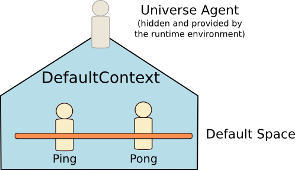

# Agent Communication with the Ping Pong Agents


<ul class="page_outline" id="page_outline">

<li><a href="#1-principle-of-the-application">1. Principle of the Application</a></li>
<li><a href="#2-event-definition">2. Event definition</a></li>
<ul>
  <li><a href="#21-ping-event">2.1. Ping Event</a></li>
  <li><a href="#22-pong-event">2.2. Pong Event</a></li>
</ul>
<li><a href="#3-pong-agent">3. Pong agent</a></li>
<ul>
  <li><a href="#31-first-definition">3.1. First definition</a></li>
  <li><a href="#32-handling-the-ping-event">3.2. Handling the Ping event</a></li>
  <li><a href="#33-replying-to-ping-with-a-pong">3.3. Replying to Ping with a Pong</a></li>
  <li><a href="#34-restricting-the-scope-of-the-pong-event">3.4. Restricting the scope of the Pong event</a></li>
</ul>
<li><a href="#4-ping-agent">4. Ping Agent</a></li>
<ul>
  <li><a href="#41-first-definition">4.1. First definition</a></li>
  <li><a href="#42-handling-the-pong-event">4.2. Handling the Pong event</a></li>
  <li><a href="#43-re-sending-a-ping-when-receiving-a-pong">4.3. Re-sending a Ping when receiving a Pong</a></li>
  <li><a href="#44-sending-the-first-ping">4.4. Sending the first Ping</a></li>
  <li><a href="#45-delaying-the-sending-of-the-first-ping">4.5. Delaying the sending of the first Ping</a></li>
</ul>
<li><a href="#5-launch-the-agents">5. Launch the agents</a></li>
<li><a href="#6-legal-notice">6. Legal Notice</a></li>

</ul>


This document describes how to create a simple agent-based application in which agents are
exchanging basic messages.
Before reading this document, it is recommended reading
the [General Syntax Reference](../reference/GeneralSyntax.html).

<div class="bt-download">
<a href="https://github.com/sarl/sarl/tree/master/contribs/io.sarl.examples/io.sarl.examples.plugin/projects/io-sarl-tutorials-pingpong/src/main/sarl/io/sarl/examples/pingpong"></a>
</div>
The elements that are explained in this tutorial are:

* the definition of an event;
* the definition of an agent;
* the sending of an event occurrence in the default space;
* the receiving of event occurrences; and
* the definition of a _proactive_ behavior: waiting for partners.

The source code related to this tutorial may be found
in the [GitHub of the SARL demos](https://github.com/sarl/sarl/tree/master/contribs/io.sarl.examples/io.sarl.examples.plugin/projects/io-sarl-tutorials-pingpong/src/main/sarl/io/sarl/examples/pingpong).


## 1. Principle of the Application

The principle of the application is the following:

* The `Ping` agent is sending a `Ping` message to all agents. 
* The `PongAgent` agent is receiving the `Ping` message, and replies with a `Pong` message to the sender of the `Ping` message.
* The `Ping` agent is receiving a `Pong` message and replies to the sender of the `Pong` with a new `Ping` message.


These messages contain an integer number that indicates the number of the event.




## 2. Event definition

First, the `Ping` and `Pong` events must be defined.

### 2.1. Ping Event

The `Ping` is an event that contains the index of the event. This index indicates
at which position the event is located in the sequence of sent `Ping` event.

The `index` attribute is a _value_, for making it unmodifiable after its initialization.

For setting the value of the `index` value, it is mandatory to define a constructor. 


### 2.2. Pong Event

The `Pong` is an event that contains the index of the `Ping` event for which the
`Pong` event is created.

The `index` attribute is also a _value_, and it must be set in a constructor. 

```sarl
event Pong {
	val index : int
	new(i : int) {
		this.index = i
	}
}
```


## 3. Pong agent

The second step of this tutorial is the definition of the
agent that is waiting for `Ping` events, and replying
`Pong` events.


### 3.1. First definition

The initial definition of the pong agent is:

```sarl
agent PongAgent {
}
```


### 3.2. Handling the Ping event

The pong agent needs to handle the `Ping` events.
For that, a "behavior unit" must be defined in the
agent. According to the 
[Agent Reference](../reference/Agent.html),
the `on` keyword followed by the name of the event 
permits to define a handler of events.
This handler will be invoked by the runtime environment
each time the agent is receiving a `Ping` event.

```sarl
agent PongAgent {
	on Ping {
	}
}
```


### 3.3. Replying to Ping with a Pong

Now, it is time to define how the pong agent is replying with a `Pong` message.

First, sending an event in the default space must be done with a built-in capacity:
`DefaultContextInteractions`. This capacity provides a collection of functions that 
enable the agent to interact with the default context, and its default space.

For using the capacity, it is recommended declaring it with the `uses` keyword.
This keyword permits the agent to directly call the functions of the capacity as if
they were defined as actions in the agent.

The `DefaultContextInteractions` capacity provides the function `emit(Event)` for
emitting an event in the default space of the default context.


The `Pong` event must be built with an index value as argument. This argument
is the index stored in the `Ping` event. For accessing the occurrence of the
`Ping` event, you must use the special keyword `occurrence`.
In the following example, the `Pong` event is built with the index argument
stored in the received `Ping` event.

```sarl
agent PongAgent {
	uses DefaultContextInteractions
	on Ping {
		emit( new Pong( occurrence.index ) )
	}
}
```


### 3.4. Restricting the scope of the Pong event

In the previous code, the event is emitted to all the agents belonging to the default
space, including the pong agent.

For restricting the receiver of the `Pong` event to the initial sender of the
`Ping` event, you must define a scope for the `Pong` event.
The `DefaultContextInteractions` capacity provides the function `emit(Event, Scope<Address>)`
for sending an event with a specific scope.


If you have to scope to a single address or a single identifier, you should use the lambda expression notation,
as illustrated in the following code. In this code, the scope permits to restrict to the initial sender
of the `Ping` event. 

```sarl
agent PongAgent {
	uses DefaultContextInteractions
	on Ping {
		emit(new Pong( occurrence.index ))
			[ it == occurrence.source ]
	}
}
```


## 4. Ping Agent

The third step of this tutorial is the definition of the agent that is sending `Ping` events, and waiting for
`Ping` events.


### 4.1. First definition

The initial definition of the ping agent is:

```sarl
agent PingAgent {
}
```


### 4.2. Handling the Pong event

The ping agent needs to handle the `Pong` events. For that, a "behavior unit" must be defined in the
agent.

```sarl
agent PingAgent {
	on Pong {
	}
}
```


### 4.3. Re-sending a Ping when receiving a Pong

When the ping agent is receiving a `Pong` event, it re-sends a `Ping` event
to the sender of the `Ping` event.
This new `Ping` event has an index greater than the one of the `Pong` event.

The receiving of the `Ping` event is restricted to the sender of the
`Pong` event.

```sarl
agent PingAgent {
	uses DefaultContextInteractions
	on Pong {
		emit(new Ping( occurrence.index + 1 ))
			[ it == occurrence.source ]
	}
}
```


### 4.4. Sending the first Ping

For starting the exchanges among the agents, it is mandatory to send a first occurrence
of the `Ping` event.

This emit is done when the ping agent is started, i.e. when the agent is
receiving the `Initialize` event.

```sarl
agent PingAgent {
	uses DefaultContextInteractions
	on Pong {
		emit(new Ping( occurrence.index + 1 ))
			[ it == occurrence.source ]
	}
	on Initialize {
		emit( new Ping(0) )
	}
}
```


### 4.5. Delaying the sending of the first Ping

The previous code has a major problem: if there is no pong agent launched
when the ping agent is sending the first `Ping` event, the application
will reach a deadlock, even if the pong agent is launched later.

For solving this problem, the ping agent must wait for sending the initial
`Ping` event until the pong agent is belonging to the default space.

The concrete implementation is based on the `Schedules` capacity, which provides
a collection of functions for creating and launching asynchronous tasks.

In the following code, a task is created with the name `waiting_for_partner`.
This task is executed every second with the `every` function (given by the `Schedules`
capacity). The code between the brackets contains the statements
that will be periodically executed.

In this periodically executed code, the agent is testing if it is the only
one agent belonging to the default space. If not, the agent is sending the initial
`Ping` event, and stopping the periodic task.

```sarl
agent PingAgent {
	uses DefaultContextInteractions, Schedules
	on Pong {
		emit(new Ping( occurrence.index + 1 ))
			[ it == occurrence.source ]
	}
	on Initialize {
		val task = task("waiting_for_partner")
		task.every(1000) [
			if (defaultSpace.numberOfStrongParticipants > 1) {
				emit( new Ping(0) )
				task.cancel
			}
		]
	}
}
```


## 5. Launch the agents

The fourth step of this tutorial is the definition of the launching process.
In the rest of this section, we discuss the use of the
[Janus runtime environment](http://www.janusproject.io) for running the agents.
The Janus platform is designed to launch a single agent at start-up.
Then, this launched agent must spawn the other agents in the system.


The principle is to launch a single instance of Janus, and run all the agents inside.
Because of the design of the Janus platform, we must define an
agent that will launch the other agents. This agent is named
`BootAgent`. It is defined below.


The boot agent uses the `Lifecycle` capacity for launching agents in the default context.
This capacity provides the function `spawn(Class<? extends Agent>)`
for launching an agent of the given type.
When the boot agent has launched the two expected agents,
it is killing itself. This is done with the `killMe`
function, which is provided by the `Lifecycle` capacity too.


```sarl
agent BootAgent {
	uses Lifecycle
	on Initialize {
		spawn(PongAgent)
		spawn(PingAgent)
		killMe
	}
}
```


## 6. Legal Notice

* Specification: SARL General-purpose Agent-Oriented Programming Language ("Specification")
* Version: 0.13
* Status: Stable Release
* Release: 2023-09-19

> Copyright &copy; 2014-2023 [SARL.io, the Original Authors and Main Authors](https://www.sarl.io/about/index.html).
>
> Documentation text and medias are licensed under the Creative Common CC-BY-SA-4.0;
> you may not use this file except in compliance with CC-BY-SA-4.0.
> You may obtain a copy of [CC-BY-4.0](https://creativecommons.org/licenses/by-sa/4.0/deed.en).
>
> Examples of SARL code are licensed under the Apache License, Version 2.0;
> you may not use this file except in compliance with the Apache License.
> You may obtain a copy of the [Apache License](http://www.apache.org/licenses/LICENSE-2.0).
>
> You are free to reproduce the content of this page on copyleft websites such as Wikipedia.

<small>Generated with the translator docs.generator 0.13.0.</small>
