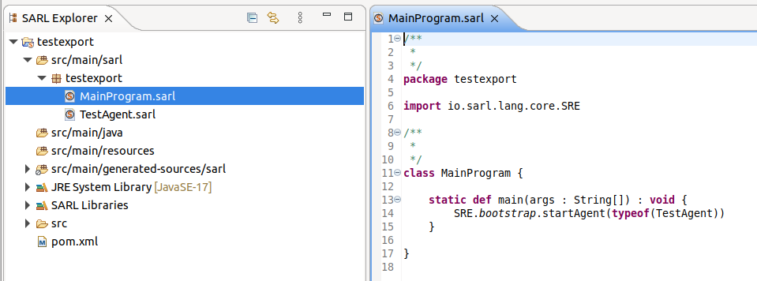
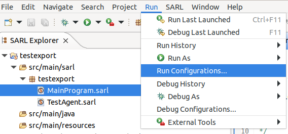
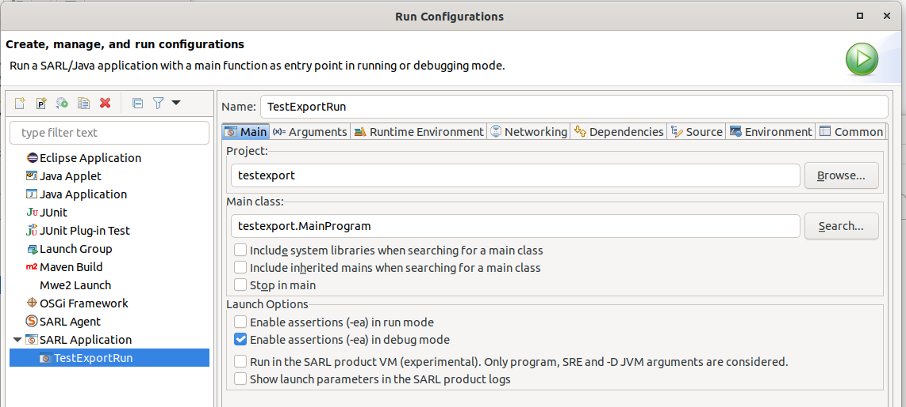
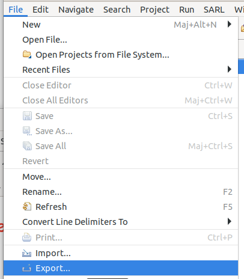
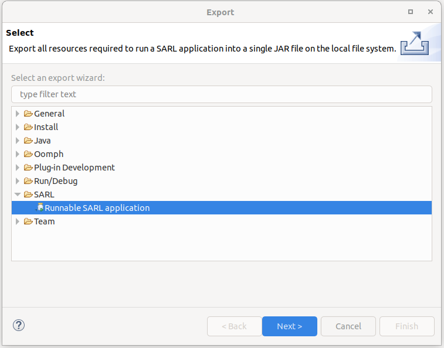
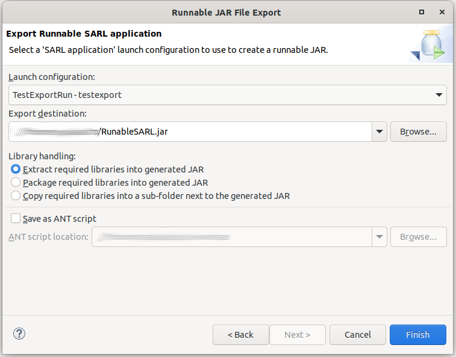

# Create a runnable application (Jar) file for SARL application


<ul class="page_outline" id="page_outline">

<li><a href="#1-preparing-the-sarl-project">1. Preparing the SARL project</a></li>
<ul>
  <li><a href="#11-sarl-project-sample">1.1. SARL Project Sample</a></li>
  <li><a href="#12-sarl-application-run-configuration">1.2. SARL Application Run Configuration</a></li>
</ul>
<li><a href="#2-creating-the-runnable-application-file">2. Creating the runnable application file</a></li>
<li><a href="#3-version-specification">3. Version Specification</a></li>
<li><a href="#4-legal-notice">4. Legal Notice</a></li>

</ul>


Usually, it's convenient to bundle many SARL entity files into a single archive file. This file is named runnable application file (a.k.a. runnable jar file in the Java community).
It allows a use to run SARL entities without having to know their names and type them in a command prompt, rather the user can just double click on the runnable application file and the program will fire up.
A runnable application file allows SARL entities to be loaded just like when a user clicks an regular executable file.

In this tutorial, we're going to cover the key points for creating a runnable application file for SARL.
Specifically, we'll take a simple application and explore the ways to package and run it as a runnable file.


## 1. Preparing the SARL project

Before creating the runnable application file, it is necessary to have a SARL project and its associated run configuration.

### 1.1. SARL Project Sample

For creating a runnable application file, you must create or have a SARL project with a "main program" as it is illustrated in the following figure.



The mandatory element in your program must be the `main` function:

```sarl
static def main(args : String[]) : void {
}
```


You could find a description of the method for [creating your first SARL project](../../getstarted/CreateFirstProject.html).


### 1.2. SARL Application Run Configuration

Once you have implemented your SARL program, you must define a run configuration.
This configuration is a feature of the SARL IDE that enables to define a method for
[launching the program within the SARL Eclipse IDE](../../getstarted/RunSARLAgentEclipse.html).

For defining the run configuration, you should follow the steps:

1. Open the dialog box for the run configurations.



2. Create a SARL Application, as illustrated in:




## 2. Creating the runnable application file

To create a new runnable application file in the workbench:

* From the menu bar's File menu, select Export.



* Expand the SARL node and select "Runnable SARL application". Click Next.



* In the wizard page, select your run/launch configuration to use to create a runnable file.



* In the Export destination field, either type or click Browse to select a location for the JAR file that will contain the runnable application
* Run the exporter.


## 3. Version Specification

* Specification: SARL General-purpose Agent-Oriented Programming Language ("Specification")
* Version: 0.15
* Status: Stable Release
* Release: 2025-09-11

## 4. Legal Notice

> Copyright &copy; 2014-2025 [SARL.io, the Original Authors and Main Authors](http://www.sarl.io/about/index.html).
>
> Documentation text and medias are licensed under the Creative Common CC-BY-SA-4.0;
> you may not use this file except in compliance with CC-BY-SA-4.0.
> You may obtain a copy of [CC-BY-4.0](https://creativecommons.org/licenses/by-sa/4.0/deed.en).
>
> Examples of SARL code are licensed under the Apache License, Version 2.0;
> you may not use this file except in compliance with the Apache License.
> You may obtain a copy of the [Apache License](http://www.apache.org/licenses/LICENSE-2.0).
>
> You are free to reproduce the content of this page on copyleft websites such as Wikipedia.

<small>Generated with the translator docs.generator 0.15.1.</small>
