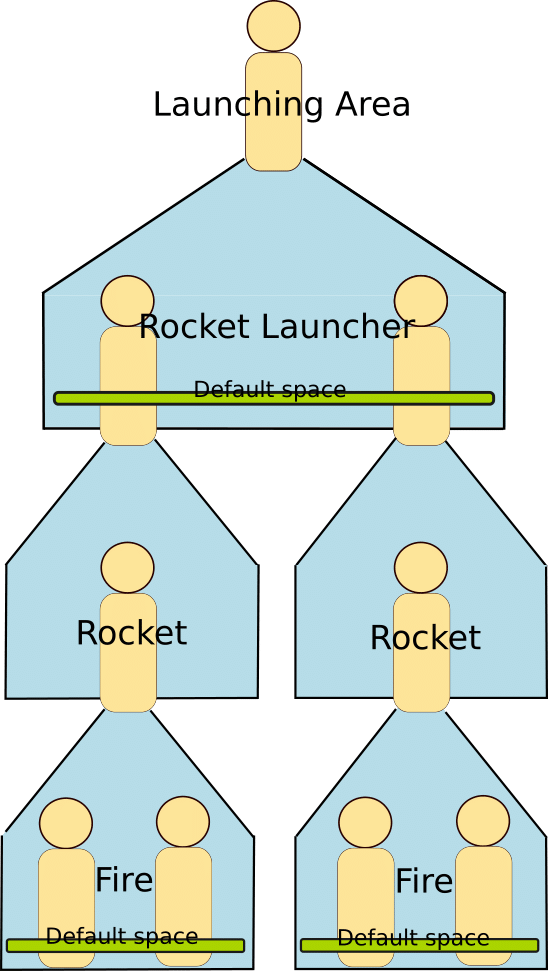
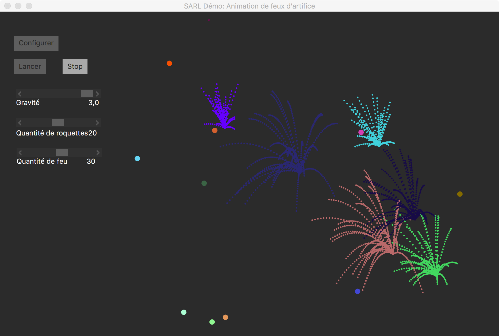

# Fireworks demonstration


The goal of this demo is to bring out some fireworks using SARL agents.

## Launching the demonstration

* From SARL ID:
  1. Create a launch configuration of type "SARL Application"
  2. As the main class, select `io.sarl.demos.fireworks.Fireworks`
* From command-line interface:
  1. Launch the application as a standard Java program.

## Description of the software

The application is composed of 4 agents. The whole structure is holonic.



The main agent is the *LaunchingArea* which is linked with the GUI and and contains the other agents inside its inner context.
This agent creates the *RocketLauncher*, one by rocket asked by the user. It also transmits the gravity and other parameters.
This agent also registers the GUI on a dedicated OpenEventSpace for communication.

```sarl
agent LaunchingArea {

    ...

    /*
     * Get setup event from the GUI
     */
    on SetupSettings {
        this.rocketsQuantity = occurrence.rocketsQuantity
        this.fireQuantity = occurrence.fireQuatity
        this.gravity = occurrence.gravity
        this.maxWidth = occurrence.maxWidth
    }

    /*
     * Agent initialisation when spawned by the GUI
     * A communication space is opened between
     *      the GUI and this agent
     */
    on Initialize [!occurrence.parameters.empty] {
        var ctrl = occurrence.parameters.get(0) as FXMLViewerController
        var ispace = defaultContext.createSpace(
            OpenEventSpaceSpecification, UUID.randomUUID)
        ctrl.setGUISpace(ispace)
        ispace.register(asEventListener)

        ctrl.listenAndDraw(grid)

        info("Finishing initialization of Launching Area")

    }

    ...
}
```

Then, each RocketLauncher creates a *Rocket*. When this one is destroyed, the *RocketLauncher* is going to generate another one. This allows to displace the verification of the existence of the *Rocket* out of the LaunchingArea. It also isolates the *Rocket* and avoid that emitted events disrupt the managing of the simulation.

```sarl
agent RocketLauncher {

    ...

    /*
     * A new rocket is launched when the previous
     *      one is destroyed
     */
    on MemberLeft [!isFromMe(occurrence) && !exited] {
        // wake allows to send the event at the agent itself
        wake(new Launch)
    }
    ...
}
```

*Rocket* agents are the heart of this demo. Each one create a task with a fixed delay where they updates their position by writing it in a object shared with the GUI, here named *Positions*. When the *Rocket* reach the end of its lifetime, they create *Fire* agent within their inner context according to the quantity asked by the user and then wait for the destruction of every *Fire* to kill themselves.

```sarl
agent Rocket {

    ...

    on Initialize {

        ...

        /*
         * Create a new background task to update
         *      the agent position at a fixed delay
         */
        move = atFixedDelay(
            Configuration.RocketLifeCycleSchedulingRate) [
            try {
                wake(new UpdateRocketPosition);
            } catch (e : Exception) {
                e.printStackTrace
            }
        ]
    }

    on UpdateRocketPosition [isFromMe(occurrence) &&
                             !frozen && !exploded] {
        var vect = new Vector(2)
        x = x + speedx
        y = y + speedy
        vect.clear()
        vect.add(x)
        vect.add(y)
        lifetime = lifetime - 10

        /* Updates the Position object */
        if (grid !== null)
            grid.setRocketPosition(id, vect)
        if (lifetime <= 0) {
            exploded = true
            move.cancel(true)
            grid.hideHocketPosition(id)
            wake(new Explode)
        }
    }

    ...
}

```
The *Fire* is the last agent of the demo. It have a list of positions and is subjected to gravity. As *Rocket* agent, the *Fire* launch a task at a fixed delay to update its actual position, add it at the end of the actual list and then update the *Positions* object. When its lifetime is over, the *Fire* is destroyed.


## MVC pattern

This application follows a MVC (Model-View-Controller) pattern for the GUI communication.


When the GUI is closed, an event *Exit* is sent to the *LaunchingArea* which transmits it to the other agents she owns. It waits for their elimination to destroy the next one, until itself.

## User Interface



## Code

[**Code on GitHub**](https://github.com/sarl/sarl/tree/master/sarl-eclipse/plugins/io.sarl.eclipse.examples/projects/io-sarl-demos-fireworks)
